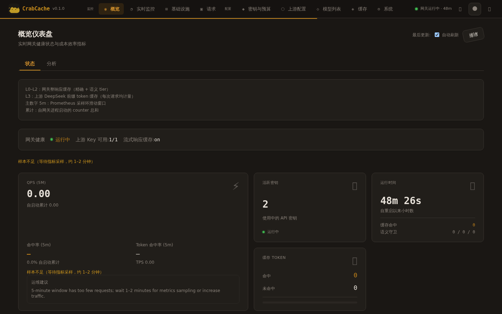
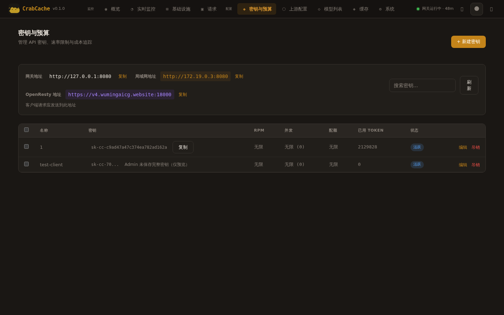
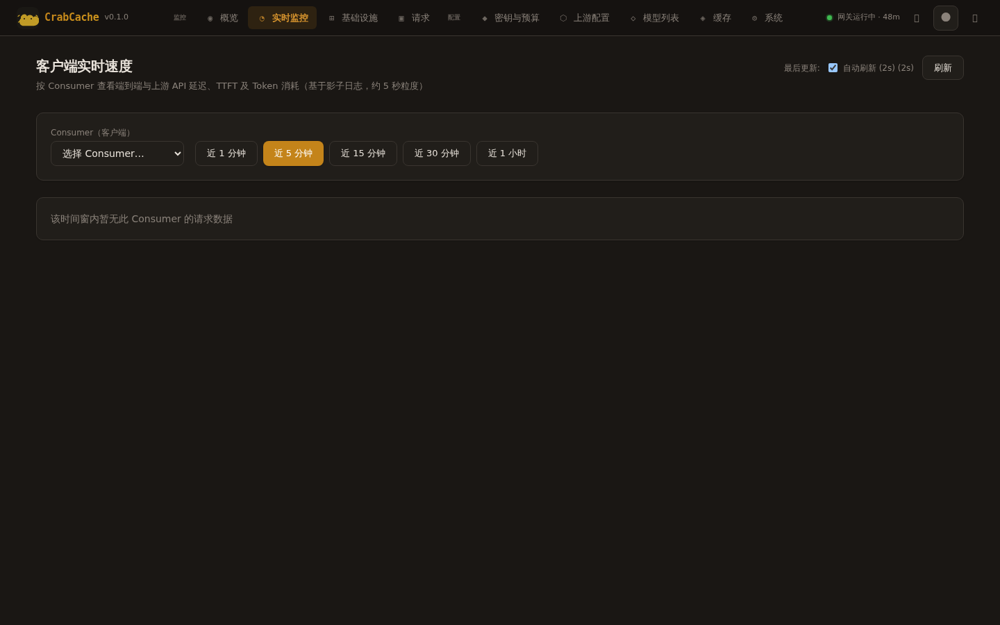
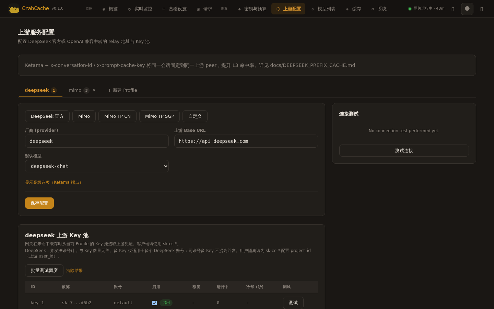
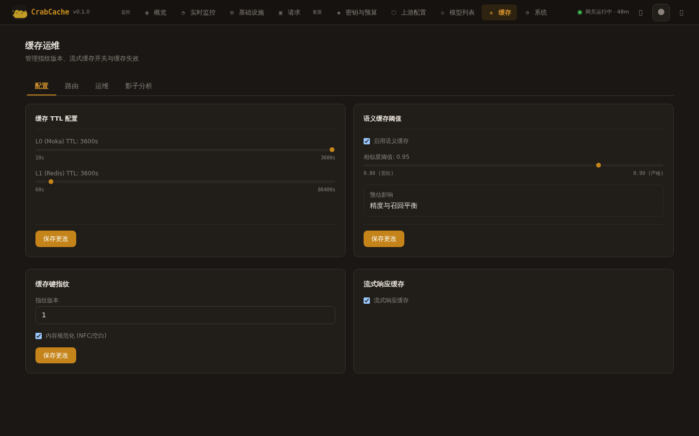

<div align="center">
  <h1>CrabCache</h1>
  <p><strong>基于 Pingora 的高性能多供应商 LLM API 网关，以 DeepSeek V4 为重点，专注缓存优化与可观测透明分析</strong></p>

  <!-- Quick Links -->
  <p>
    <a href="https://smile9493.github.io/CrabCache/"><strong>📖 文档网站</strong></a>
    &nbsp;·&nbsp;
    <a href="https://smile9493.github.io/CrabCache/demo"><strong>🎮 在线演示</strong></a>
    &nbsp;·&nbsp;
    <a href="docs/DESIGN.md"><strong>UI 规范</strong></a>
  </p>

  <!-- Badges -->
  <a href="https://www.rust-lang.org/"></a>
  <a href="https://opensource.org/licenses/MIT"></a>
  <a href="https://github.com/cloudflare/pingora"></a>
  <a href="https://smile9493.github.io/CrabCache/"></a>
  <a href="https://github.com/smile9493/CrabCache/actions/workflows/ci.yml"></a>
  <a href="https://github.com/smile9493/CrabCache/actions/workflows/deploy-docs.yml"></a>

  <br>

  <a href="#特性">特性</a> •
  <a href="#快速开始">快速开始</a> •
  <a href="#架构">架构</a> •
  <a href="#文档">文档</a> •
  <a href="#部署">部署</a> •
  <a href="#性能">性能</a> •
  <a href="#贡献">贡献</a>

</div>

---

## 概述

**CrabCache 以 [Cloudflare Pingora](https://github.com/cloudflare/pingora) 为网络与代理核心**：在 Pingora 的 `ProxyHttp` 生命周期（`request_filter` → `upstream_peer` → 流式 `body_filter` → `logging`）上实现 OpenAI 兼容的多供应商 LLM API 网关。以 DeepSeek V4 为重点参考实现（当前唯一支持 Reasoning/thinking 的供应商），同时兼容其他主流供应商。

Pingora 提供的能力是本项目的基础：

- **无锁连接池** — 多线程共享上游连接，适合长连接 SSE 流式响应
- **Rust 原生、内存安全** — 热路径零拷贝（`bytes::Bytes`），生产环境使用 jemalloc
- **可编程代理管线** — 在过滤器链中完成认证、路由、SSE 改写、指标与 Trace，无需外挂 Lua/Nginx 脚本

在此之上，CrabCache 提供多供应商 LLM 的**缓存优化**能力：三级响应缓存（L0–L2）、DeepSeek Reasoning SSE 处理、请求合并（Coalescing）、多 Profile 上游路由，以及完整的 Management API 与 Admin Dashboard 可观测性体系。

> **关于缓存层级**：Moka / Redis / Qdrant 缓存的是**完整响应体**，与上游服务端前缀缓存（如 DeepSeek L3 `prompt_cache_hit_tokens`）不是同一指标。详见 [上游前缀缓存 L3](docs/DEEPSEEK_PREFIX_CACHE.md)。

### 核心能力（按架构分层）

| 层级 | 内容 |
|------|------|
| **Pingora 核心** | `crab-proxy` 实现 `ProxyHttp`；连接复用、SSE 流式 flush、上游 TLS/SNI |
| **路由** | `crab-route` Ketama 环；会话亲和，支撑上游多节点前缀缓存 |
| **缓存** | L0 Moka + L1 Redis + L2 Qdrant 三级缓存；Coalescing 防击穿 |
| **多供应商** | 多 Profile 上游路由、Key 池轮换、429 退避、模型别名 |
| **控制面** | `crab-gateway` Management API；`crab-admin` + Leptos Dashboard |

---

## 特性

### 🚀 Pingora 代理核心

- **Cloudflare Pingora 0.8** — 代理主循环与连接池由 Pingora 驱动；`crab-proxy::GatewayProxy` 实现完整请求生命周期
- **SSE 流式** — 在 `upstream_response_body_filter` 中逐 chunk 处理；生产需 Linux（macOS 存在 Pingora flush 问题，见 [Issue #841](https://github.com/cloudflare/pingora/issues/841)）
- **零拷贝** — 响应体以 `Bytes` 传递，减少热路径分配
- **jemalloc** — 非 MSVC 目标默认启用，适配高并发长连接

### 🗄️ 缓存分层（勿混谈命中率）

| 层级 | 位置 | 作用 | 典型场景 |
|------|------|------|----------|
| **L0–L2** | 网关 | 缓存**完整响应**（精确 SHA256 / 语义向量） | 完全相同 body 重放、合并后的回填 |
| **L3** | 上游服务端 | 服务端 **KV/前缀缓存**（按 Token 计费折扣） | 多轮对话共享稳定 system+历史前缀；**主要降本路径** |

L0–L2 技术栈：Moka（内存）、Redis（分布式）、Qdrant + ONNX 嵌入（语义，阈值可配）。指标上请分别看 `gateway_cache_requests_total` 与 `gateway_upstream_prompt_cache_tokens_total`。

### 🔄 智能路由

- **Ketama 一致性哈希** — 会话亲和路由，最大化上游前缀缓存命中率
- **会话亲和性** — 支持 `x-conversation-id` / `x-prompt-cache-key` 粘滞路由
- **动态热更新** — 通过 Management API 运行时增删后端节点

### 🧠 推理内容管理

- **推理缓存与恢复** — SSE 流中实时检测和恢复缺失的 reasoning 内容
- **SQLite / Redis 双后端** — 单实例 SQLite，多实例 Redis 共享
- **Cursor 兼容** — 支持 Cursor IDE 的可折叠推理内容显示协议
- **策略配置** — `recover` / `reject` 策略，与 deepseek-cursor-proxy 行为一致

### 🛡️ 企业级

- **多租户隔离** — `project_id` → 上游 `user_id` 映射 + 动态缓存命名空间
- **请求合并（Coalescing）** — 防缓存击穿（Cache Stampede）
- **API 密钥管理** — 动态创建/吊销/启停，支持消费者标签和配额
- **缓存键指纹** — 版本化指纹，安全失效旧缓存
- **SecretString** — API Key 自动脱敏，杜绝日志泄露

### 📊 可观测性

- **Prometheus 指标** — Token 成本、缓存命中率、延迟分布、成本节省估算
- **影子日志** — 脱敏 JSONL 日志，支持命中率分析与参数拟合
- **结构化日志** — 基于 `tracing`，JSON + 控制台双输出

---

## 快速开始

### 环境要求

- **Rust**: 2024 Edition（stable）
- **系统**: Linux 内核（生产必需；macOS 存在 [Pingora SSE Bug](https://github.com/cloudflare/pingora/issues/841)）
- **依赖**: Redis（必需，L1 缓存），Qdrant（可选，L2 语义缓存）

### 构建与运行

```bash
# 克隆仓库
git clone https://github.com/smile9493/CrabCache.git
cd CrabCache

# 构建网关
cargo build --release -p crab-gateway

# 复制配置文件
cp config/gateway.example.toml config/gateway.toml
```

编辑 `config/gateway.toml`，设置上游 API Key 和 Redis 地址，然后：

```bash
# 启动 Redis（L1 缓存必需）
docker compose up -d redis

# 启动网关
cargo run --release -p crab-gateway -- config/gateway.toml
```

验证网关运行：

```bash
# 健康检查
curl http://localhost:8080/health

# 发送请求
curl -X POST http://localhost:8080/v1/chat/completions \
  -H "Content-Type: application/json" \
  -H "Authorization: Bearer $(sk-cc-...)" \
  -d '{"model": "deepseek-v4-pro", "messages": [{"role": "user", "content": "Hello"}]}'
```

网关默认监听端口：

| 端口 | 用途 | 说明 |
|------|------|------|
| `:8080` | API 代理 | 客户端请求入口 |
| `:9090` | Prometheus 指标 | 可观测性 |
| `:9080` | Management API | 控制面（默认仅 loopback） |
| `:3000` | Admin Dashboard | Web 管理面板（crab-admin） |

---

## 架构

### 请求处理流程

```
客户端请求
  │
  ├─ request_filter ──────────────────────────────
  │  ├─ 认证（Bearer Token → DashMap / bootstrap）
  │  ├─ 缓存键生成（Fingerprint + Namespace）
  │  ├─ L0/L1/L2 缓存查找 → 命中 → 直接返回
  │  └─ Request Coalescing（Leader/Follower）
  │
  ├─ upstream_peer ───────────────────────────────
  │  └─ Ketama 一致性哈希选择后端
  │
  ├─ upstream_response_body_filter ───────────────
  │  ├─ 非流式：累积 → EOS 时写入缓存
  │  ├─ 流式：逐 chunk SSE 改写 + Reasoning 恢复
  │  └─ EOS 时合成消息 → 写入缓存
  │
  └─ logging ─────────────────────────────────────
     ├─ 结构化日志（请求 ID、延迟、缓存状态）
     └─ 脱敏 Trace 日志（JSONL 文件）
```

### 模块依赖

```
crab-gateway（入口 + Pingora Server + 管理 API）
 ├── crab-proxy      ProxyHttp 实现、SSE 流处理
 │   ├── crab-route      Ketama 一致性哈希路由
 │   ├── crab-cache      L0 Moka + L1 Redis 缓存
 │   ├── crab-semantic   L2 Qdrant 语义缓存
 │   ├── crab-reasoning  推理内容管理与恢复
 │   └── crab-metrics    Prometheus 指标采集
 └── crab-control    管理 API 客户端 + 共享 DTO 类型

crab-admin（管理面板后端 - Axum HTTP 服务器）
 ├── crab-control    Gateway 管理 API 客户端
 └── crab-dashboard  Leptos WASM 前端
```

---

## 文档

完整文档构建在 [GitHub Pages](https://smile9493.github.io/CrabCache/) 上，基于 MkDocs Material 主题。包含以下内容：

### 入门指南

| 文档 | 说明 |
|------|------|
| [Cursor + DeepSeek 接入](docs/CURSOR_SETUP.md) | 在 Cursor IDE 中通过 CrabCache 使用 DeepSeek |
| [从 new-api 迁移](docs/NEW_API_MIGRATION.md) | 从 new-api + deepseek-cursor-proxy 双栈迁移 |
| [Agent Key 迁移](docs/AGENT_CLIENT_KEY_MIGRATION.md) | 客户端 API Key 升级指南 |

### 供应商集成

| 文档 | 说明 |
|------|------|
| [上游前缀缓存 L3](docs/DEEPSEEK_PREFIX_CACHE.md) | DeepSeek 服务端 KV 前缀缓存实践 |
| [Cursor Proxy 对照](docs/DEEPSEEK_CURSOR_PROXY_PARITY.md) | 与 deepseek-cursor-proxy 功能对照 |
| [功能吸收计划](docs/CURSOR_DEEPSEEK_ABSORPTION_PLAN.md) | 迁移路线图 |

### 运维管理

| 文档 | 说明 |
|------|------|
| [多租户隔离](docs/MULTI_TENANT.md) | project_id / DeepSeek user_id 隔离机制 |
| [持久化指南](docs/PERSISTENCE.md) | 数据存储、多实例部署与备份 |
| [推理内容存储](docs/REASONING_STORE.md) | ReasoningStore 与稳定会话 scope 机制 |
| [可观测性](docs/OBSERVABILITY.md) | Prometheus 指标、Dashboard、影子日志 |

### 部署指南

| 文档 | 说明 |
|------|------|
| [1Panel + OpenResty 部署](docs/deploy-1panel-openresty.md) | 使用 1Panel 和 OpenResty 反代 |
| [网络地址配置](docs/network-config.md) | 网关地址自动检测与局域网配置 |
| [自签名证书](docs/self-signed-cert.md) | 为管理面板生成 SSL 证书 |

> 文档站点通过 [`.github/workflows/deploy-docs.yml`](.github/workflows/deploy-docs.yml) 自动部署：当 `docs/` 或 `mkdocs.yml` 变更时，自动构建并推送到 `gh-pages` 分支。

---

## 部署

### Docker Compose（推荐）

```bash
cp .env.example .env
# 编辑 .env：设置 CRABCACHE_API_KEY、CRABCACHE_GATEWAY_ADMIN_KEY
docker compose up -d --build
```

默认启动服务：**gateway + Redis**（L2 语义缓存关闭），Redis 不暴露宿主机端口。

完整 Docker 部署指南参见 [`docs/PERSISTENCE.md`](docs/PERSISTENCE.md) 和部署文档。

### 管理面板

基于 **Leptos WASM + Axum** 的现代 Web 管理界面，暖琥珀色主题，支持深色/浅色/极夜三种主题切换。[在线演示](https://smile9493.github.io/CrabCache/demo)

**登录页面** — 安全的 Admin Key 认证：


**仪表盘概览** — 核心指标 Bento Grid 布局，包含 QPS、命中率、延迟分布、缓存分层等：



**API 密钥管理** — 创建、吊销、批量操作，支持多租户与行内编辑：



**实时监控** — 近实时 QPS/TPS 与 Token 趋势图，支持多窗口切换：



**上游配置** — 多厂商 Profile 管理、Key 池轮换、端点热更新：



**缓存配置** — L0/L1/L2 TTL、语义缓存、失效管理、Trace 分析：



管理面板功能概览：

| 功能 | 说明 |
|------|------|
| **仪表盘概览** | Bento Grid 指标布局、SSE 实时推送、5 分钟/累计命中率 |
| **实时监控** | QPS/TPS 趋势图、Token 使用量、多消费者/域名维度 |
| **基础设施** | Docker 容器监控、带宽测试、系统资源 |
| **请求日志** | 结构化日志查看、多维过滤、详情面板 |
| **API Key 管理** | 创建、吊销、批量操作、行内编辑，支持多租户 |
| **上游配置** | 多 Profile 管理、Key 池、端点热更新、连通性测试 |
| **模型目录** | 按 Profile 同步上游模型、别名管理 |
| **缓存配置** | L0/L1 TTL、模型/消费者覆盖、语义缓存、失效、指纹 |
| **系统配置** | Reasoning 管线、连接参数、Cursor 模型别名 |

可选 Web 管理界面（需要先构建前端）：

```bash
# 构建前端 WASM
bash scripts/build_dashboard.sh

# 启动管理面板
docker compose --profile admin up -d --build
# 访问 http://127.0.0.1:3000
```

### 密钥体系

CrabCache 使用三套独立密钥：

| 用途 | 密钥来源 | HTTP 头 |
|------|----------|---------|
| **客户端**访问网关 | Management `POST /v1/keys` 创建 `sk-cc-*` | `Authorization: Bearer` |
| **上游** 供应商配额 | `CRABCACHE_UPSTREAM_KEYS` 或 `api_key` | 仅服务端使用 |
| **管理 API** 控制面 | `CRABCACHE_GATEWAY_ADMIN_KEY` | `X-Gateway-Admin-Key` |

### Management API

网关内置 HTTP 控制面（默认 `:9080`），所有端点（除 `/v1/health`）需 `X-Gateway-Admin-Key` 认证：

| 端点 | 方法 | 说明 |
|------|------|------|
| `/v1/health` | GET | 健康检查 |
| `/v1/status` | GET | 网关状态 |
| `/v1/keys` | GET/POST | 密钥列表/创建 |
| `/v1/keys/{token}` | DELETE/PATCH | 撤销/更新密钥 |
| `/v1/cache/ttl` | GET/PUT | 缓存 TTL 配置 |
| `/v1/cache/invalidate` | POST | 清理缓存 |
| `/v1/cache/fingerprint` | GET/PUT | 指纹版本管理 |
| `/v1/routing/backends` | GET/PUT | 路由后端管理 |
| `/v1/cursor/models` | GET/PUT | Cursor 模型别名 |
| `/v1/reasoning/config` | GET/PUT | Reasoning 配置 |

---

## 性能与指标

### 设计取向（非营销口径）

| 维度 | 说明 |
|------|------|
| **代理延迟** | Pingora + 连接池；网关 L0 命中时响应极快，未命中则主要为上游 RTT |
| **降本** | 依赖 **L3 前缀命中**（Dashboard / `prompt_cache_hit_tokens`），而非 L0–L2 响应缓存占比 |
| **L0–L2** | 工程上保留，用于可观测、重复流量与 Coalescing；勿用 Trace 里「网关命中率」推断上游计费 |
| **吞吐** | 受上游限速与流式 SSE 影响；以 Prometheus QPS/延迟为准 |

### 核心 Prometheus 指标

| 指标 | 类型 | 说明 |
|------|------|------|
| `gateway_deepseek_input_tokens_total` | Counter | 上游输入 Token（按 cache_status/model/consumer 分类） |
| `gateway_output_tokens_total` | Counter | 上游输出 Token |
| `gateway_cache_requests_total` | Counter | 各层级缓存请求数 |
| `gateway_upstream_latency_seconds` | Histogram | 上游响应延迟 |
| `gateway_cache_fetch_latency_seconds` | Histogram | 缓存获取延迟 |
| `gateway_cache_cost_saved_usd_total` | Counter | 缓存节省成本估算 |

---

## 测试

```bash
# 运行所有测试
cargo test --workspace

# 代码检查
cargo clippy --workspace -- -D warnings
cargo fmt --check
```

## CI/CD

GitHub Actions 流水线（详见 [`.github/workflows/ci.yml`](.github/workflows/ci.yml)）：

- **Tag 推送** (`v*`)：全量流水线 — Lint → Test → Build → Docker → Release
- **Push/PR 到 main**：Lint + Test（跳过纯文档变更）
- 文档站点通过独立的 [`deploy-docs.yml`](.github/workflows/deploy-docs.yml) 自动部署

---

## 项目结构

```
CrabCache/
├── Cargo.toml                # Workspace 根配置（12 个 crate）
├── config/
│   └── gateway.example.toml  # 配置文件模板
├── crates/
│   ├── crab-gateway/         # 主入口（Pingora Server + 管理 API）
│   ├── crab-proxy/           # ProxyHttp 实现、SSE 流处理
│   ├── crab-route/           # Ketama 一致性哈希路由
│   ├── crab-cache/           # L0 Moka + L1 Redis 缓存
│   ├── crab-semantic/        # L2 Qdrant 语义缓存
│   ├── crab-reasoning/       # 推理内容管理与恢复
│   ├── crab-pipeline/        # 管线选择与 Cursor 模型别名
│   ├── crab-metrics/         # Prometheus 指标采集
│   ├── crab-control/         # 管理 API 客户端 + 共享类型
│   ├── crab-state/           # 控制面持久化（Redis / 内存）
│   ├── crab-admin/           # Admin Dashboard 后端（Axum）
│   └── crab-dashboard/       # Leptos WASM 前端
├── docs/                     # MkDocs 文档源文件
├── scripts/                  # 部署与验证脚本
├── deploy/                   # Nginx 配置、Prometheus 告警
├── mkdocs.yml                # 文档站点配置
├── Dockerfile                # 网关容器构建
├── docker-compose.yml        # 服务编排
└── .github/workflows/        # CI/CD 流水线
```

---

## 贡献

1. Fork 项目
2. 创建特性分支：`git checkout -b feature/your-feature`
3. 提交变更：`git commit -m 'Add your feature'`
4. 推送到分支：`git push origin feature/your-feature`
5. 创建 Pull Request

提交前请确保：

```bash
cargo fmt --check
cargo clippy --workspace -- -D warnings
cargo test --workspace
```

同时建议启用 **GitHub Actions 工作流的纯静态检查**（不依赖 Docker、不跑任何构建），在提交前几秒内拦截 YAML / 表达式 / 结构错误：

```bash
# 1) 安装（示例：Linux/macOS）
brew install actionlint
npm install -g action-validator

# 2) 启用 pre-commit（首次）
pip install pre-commit
pre-commit install

# 3) 手动运行（可选）
actionlint
action-validator .github/workflows/*.yml .github/workflows/*.yaml
```

## 许可证

MIT License — 详见 [LICENSE](LICENSE)。

## 致谢

- [Pingora](https://github.com/cloudflare/pingora) — Cloudflare 开源的高性能网络框架
- [DeepSeek](https://www.deepseek.com/) — 提供优秀的 LLM API 服务
- [Moka](https://github.com/moka-rs/moka) — 高性能 Rust 缓存库
- [Qdrant](https://qdrant.tech/) — Rust 原生向量数据库
- [Leptos](https://leptos.dev/) — Rust Web 框架
- [Axum](https://github.com/tokio-rs/axum) — Web 框架
