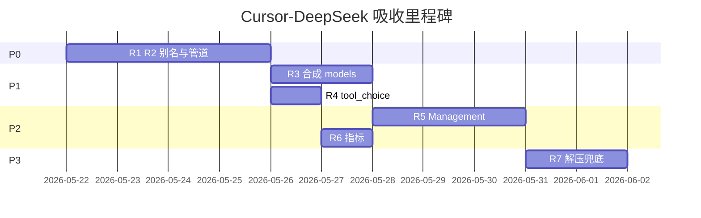

# Cursor-DeepSeek 优势吸收改进计划

本文档基于仓库内 Go 参考实现 [`cursor-deepseek/`](../cursor-deepseek/) 与当前 CrabCache `cursor_deepseek_v4` 管道能力对照，制定**可分期落地**的改进项。目标：在保留 V4 reasoning、三级缓存与运维能力的前提下，补齐 Cursor 侧「填 OpenAI 模型名即可用 DeepSeek」的体验。

相关文档：

- Cursor 接入：[`CURSOR_SETUP.md`](CURSOR_SETUP.md)
- Python 代理能力对照：[`DEEPSEEK_CURSOR_PROXY_PARITY.md`](DEEPSEEK_CURSOR_PROXY_PARITY.md)
- 参考实现：[`cursor-deepseek/README.md`](../cursor-deepseek/README.md)

---

## 背景与原则

### 参考项目职责边界

| 项目 | 职责 |
|------|------|
| `cursor-deepseek` (Go) | OpenAI 兼容层：模型别名、消息/tools 转换、响应 `model` 回写、CORS、可选合成 models 列表 |
| `deepseek-cursor-proxy` (Python) | V4 thinking：`reasoning_content` 注入/恢复、流式 Cursor 兼容 |
| **CrabCache** | 二者合一 + L0/L1/L2 缓存、密钥池、Management、可观测性 |

### 吸收原则

1. **不削弱**现有 V4 流式策略（流式不下发 `reasoning_content`、ReasoningStore recover）。
2. **不默认** `pipeline_mode = force_cursor_v4`（避免非 DeepSeek 模型误注入 `thinking`）。
3. **配置优先**：模型别名、合成 models 列表应可 TOML / Management API 热更新。
4. **改动面小**：优先扩展 `crab-pipeline` + `crab-reasoning::normalize`，避免在 `proxy.rs` 散落特殊逻辑。

### 不采纳项（明确排除）

| Go 行为 | 排除原因 |
|---------|----------|
| 去掉 reasoning 管道 | V4 多轮 tool 会 400 |
| 流式保留 `delta.reasoning_content` | Cursor 断连（见 PARITY 文档） |
| 明文全量 body 日志 | 已有脱敏 Trace；安全风险 |
| 单环境变量即客户端+上游 Key | 与 `sk-cc-*` / 上游池设计冲突 |
| 内置 ngrok | 由 OpenResty / Cloudflare Tunnel 承担 |

---

## 现状快照（2026-05）

### 已具备（无需重复建设）

- `functions` → `tools`、`function` 角色 → `tool`、`tool_choice` / `function_call` 规范化
- 多模态 `content` 数组 → 字符串
- 非 `deepseek-` 请求模型 → `[upstream].model` fallback（`upstream_model_for`）
- 响应 / SSE chunk 中 `model` 回写为客户端 `original_model`
- 路径：`/v1/chat/completions`、`/chat/completions`；`GET /v1/models` 透传上游
- 可选 `[gateway] cors_enabled`

### 主要缺口（相对 Go）

| 缺口 | 影响 |
|------|------|
| Cursor 填 `gpt-4o` 等不触发 `cursor_deepseek_v4` | 无 reasoning 恢复，多轮 tool 易失败 |
| `gpt-*` 可能解析到 `openai` profile | 请求发往错误上游 |
| `/v1/models` 仅透传 | Cursor 下拉无别名模型；依赖上游 Key 池 |
| DeepSeek 不支持的 `tool_choice` 形态 | 偶发上游 400（Go 强制降为 `auto`） |

---

## 改进项总览

| 阶段 | 编号 | 改进项 | 优先级 | 预估工作量 |
|------|------|--------|--------|------------|
| P0 | R1 | Cursor 模型别名表 + 上游模型解析 | P0 | 2–3d |
| P0 | R2 | 别名命中时自动选择 `cursor_deepseek_v4` | P0 | 1d（与 R1 同 PR） |
| P1 | R3 | 合成 `/v1/models` 列表（可配置） | P1 | 1–2d |
| P1 | R4 | DeepSeek `tool_choice` 保守降级 | P1 | 0.5–1d |
| P2 | R5 | Management API：别名 CRUD + 文档 | P2 | 1–2d |
| P2 | R6 | 指标与管道选择 reason 可观测 | P2 | 0.5d |
| P3 | R7 | 上游压缩响应解压兜底（按需） | P3 | 1d（仅在有线上证据时） |

---

## P0：Cursor 模型别名 + V4 管道联动（核心）

### 目标

用户在 Cursor 中填写 **`gpt-4o` / `gpt-4` / `deepseek-chat`** 等时，行为接近 `cursor-deepseek`：

- 出站上游模型为配置的 DeepSeek 模型（如 `deepseek-v4-pro`）
- 响应 `model` 字段仍为 Cursor 请求的原始名
- 在 DeepSeek profile + Cursor 信号下，自动走 **`cursor_deepseek_v4`**（含 reasoning 恢复）

### 配置设计（建议）

在 `config/gateway.example.toml` 增加：

```toml
[gateway.cursor_models]
# 客户端可见 model id → 上游 DeepSeek model
# 未列出的 gpt-*/o1-*/o3-* 在 deepseek profile 下可回退到 [upstream].model
gpt-4o = { upstream = "deepseek-v4-pro", pipeline = "cursor_deepseek_v4" }
gpt-4 = { upstream = "deepseek-v4-pro", pipeline = "cursor_deepseek_v4" }
deepseek-chat = { upstream = "deepseek-chat", pipeline = "deepseek_light" }

# 全局：别名请求是否强制 deepseek profile（避免 gpt-4o 走到 openai profile）
force_deepseek_profile_for_aliases = true
```

字段语义：

| 字段 | 说明 |
|------|------|
| `upstream` | 写入出站 JSON 的 `model` |
| `pipeline` | `cursor_deepseek_v4` \| `deepseek_light` \| `auto`（沿用现有 auto 规则） |
| `force_deepseek_profile_for_aliases` | 为 true 时，`resolve_upstream_profile_id` 对别名请求固定 `deepseek` |

### 代码触点

| 模块 | 变更 |
|------|------|
| `crates/crab-gateway/src/config.rs` | `GatewaySection` 增加 `cursor_models: Option<CursorModelAliases>` |
| `crates/crab-proxy/src/runtime.rs` | 运行时可变别名表（Management 热更新，P2） |
| `crates/crab-pipeline/src/select.rs` | `auto_pipeline`：别名 + Cursor 信号 → `CursorDeepSeekV4` |
| `crates/crab-pipeline/src/profile.rs` | 别名请求不仅凭 `gpt-` 前缀选 `openai` |
| `crates/crab-reasoning/src/normalize.rs` | `prepare_upstream_request` / `prepare_light_request` 使用别名解析后的 `upstream_model` |
| `config/gateway.example.toml` | 示例与注释 |
| `docs/CURSOR_SETUP.md` | 增加「可用 gpt-4o 别名」说明 |

### 管道选择逻辑（建议伪代码）

```text
if alias.pipeline == cursor_deepseek_v4 && provider == deepseek:
    return CursorDeepSeekV4
if alias.pipeline == deepseek_light:
    return DeepSeekLight
# 否则保持现有 is_deepseek_v4_model + cursor_signals 规则
```

### 验收标准

- [ ] `model: gpt-4o` + Cursor UA / `x-conversation-id` → 管道 `cursor_deepseek_v4`，上游 body `model` 为 `deepseek-v4-pro`（或配置值）
- [ ] 响应 JSON / SSE 中 `model` 仍为 `gpt-4o`
- [ ] 多轮 tool + thinking：第二轮不因缺失 `reasoning_content` 400（复用 `scripts/verify_cursor_e2e.sh`）
- [ ] 未配置别名时行为与当前版本一致（回归）
- [ ] 单元测试：`crab-pipeline` 别名 + profile；`normalize` 上游模型解析

### 测试计划

```bash
cargo test -p crab-pipeline -p crab-reasoning
# 配置 gateway.toml 别名后
CLIENT_API_KEY=sk-cc-... bash scripts/verify_cursor_e2e.sh
```

---

## P1：合成 Models 列表 + tool_choice 降级

### R3：合成 `/v1/models`

**目标**：`GET /v1/models` 在配置开启时返回 OpenAI 兼容列表，包含别名 ID，减少 Cursor 手填模型名；可选与上游列表合并。

**配置**：

```toml
[gateway.cursor_models]
synthetic_models_enabled = true
# 仅合成别名；false 时保持现有透传上游行为
```

**行为**：

| `synthetic_models_enabled` | 行为 |
|----------------------------|------|
| `false`（默认） | 与现网一致：需上游 Key，透传 DeepSeek `/v1/models` |
| `true` | 本地 JSON：`object: list`，`data[].id` 为别名键 + 可选 `deepseek-v4-*` |

**代码触点**：`crab-proxy/src/proxy.rs`（`is_models_list` 分支）、`crab-gateway` 配置。

**验收**：

- [ ] 无上游 Key 时，`synthetic_models_enabled=true` 仍返回 200 + 列表
- [ ] 列表含 `gpt-4o` 等配置的别名 id

---

### R4：DeepSeek `tool_choice` 保守降级

**目标**：对齐 Go `convertToolChoice`：当 `tool_choice` 为「指定某一 function」且上游为 DeepSeek 时，出站改为 `"auto"`，降低 400。

**代码触点**：`crab-reasoning/src/normalize.rs` 中 `normalize_tool_choice`，或 DeepSeek 专用分支。

**验收**：

- [ ] 请求含 `tool_choice: { type: function, function: { name: "x" } }` 出站为 `"auto"`
- [ ] `auto` / `none` / `required` 不变

---

## P2：运维与可观测性

### R5：Management API 别名管理

| 方法 | 路径 | 说明 |
|------|------|------|
| GET | `/v1/cursor/models` | 列出别名 |
| PUT | `/v1/cursor/models` | 全量替换别名表 |
| PATCH | `/v1/cursor/models/{id}` | 单条更新 |

同步：`crab-control` 类型、`crab-gateway/tests/management_api.rs`、`crab-dashboard` Keys/设置页（可选）。

### R6：指标与日志

- Prometheus：`gateway_pipeline_selected_total{pipeline,reason}` 已有则补充 `reason=alias` / `model_alias`
- Trace JSONL：记录 `client_model`、`upstream_model`、`alias_hit`

---

## P3：按需项

### R7：上游压缩体解压兜底

**触发条件**：非流式路径出现「上游 `Content-Encoding: gzip` 导致 JSON 改写失败」的线上案例。

**实现**：仅在 `rewrite_response_body` 前对 body 按 `Content-Encoding` 解压；依赖 `flate2` / `brotli`（评估 workspace 依赖）。

**默认**：不实现，除非 P3 有证据。

---

## 实施顺序与里程碑



| 里程碑 | 交付物 | 用户可见变化 |
|--------|--------|----------------|
| **M1 (P0)** | R1+R2 合并 PR | Cursor 可填 `gpt-4o`，自动 V4 + reasoning |
| **M2 (P1)** | R3+R4 | 模型下拉更友好；tool 调用更稳 |
| **M3 (P2)** | R5+R6 | Dashboard 改别名无需改 TOML |
| **M4 (P3)** | R7（可选） | 特定压缩场景稳定性 |

---

## 文档与配置变更清单

| 文件 | 变更 |
|------|------|
| `docs/CURSOR_DEEPSEEK_ABSORPTION_PLAN.md` | 本文档 |
| `docs/CURSOR_SETUP.md` | 增加别名配置章节；默认仍推荐 `deepseek-v4-*` |
| `docs/DEEPSEEK_CURSOR_PROXY_PARITY.md` | 增加与 `cursor-deepseek` 对照一行 |
| `config/gateway.example.toml` | `[gateway.cursor_models]` 示例 |
| `CLAUDE.md` | 架构决策索引链到本计划（可选一句） |

---

## 风险与缓解

| 风险 | 缓解 |
|------|------|
| 别名误配导致错误上游模型 | 启动时校验：别名 `upstream` 须为 `deepseek-*` 或配置白名单 |
| `gpt-4o` 走 V4 增加 token 成本 | 文档说明；别名可设 `pipeline = deepseek_light` |
| 合成 models 与真实上游不一致 | 列表仅展示别名 id；响应 `model` 仍以客户端请求为准 |
| 缓存键与别名 | 缓存键继续用**请求体原始 model + 消息指纹**；别名只影响出站，避免命中错缓存 |

---

## 完成定义（Definition of Done）

整个计划（P0–P2）完成时：

1. 新用户按 `CURSOR_SETUP.md` 使用 **`gpt-4o` 或 `deepseek-v4-pro`** 均可完成 Composer 多轮 tool + thinking。
2. `cargo test --workspace` 与 `cargo clippy --workspace` 通过。
3. Management 集成测试覆盖别名 GET/PUT（P2）。
4. `scripts/verify_cursor_e2e.sh` 增加别名场景（可选 `MODEL=gpt-4o`）。

---

## 附录：三方能力矩阵（目标态）

| 能力 | cursor-deepseek | deepseek-cursor-proxy | CrabCache 目标 |
|------|:---------------:|:---------------------:|:--------------:|
| gpt-4o → DeepSeek 模型 | ✅ | — | ✅ P0 |
| reasoning 恢复 | ❌ | ✅ | ✅ 已有 |
| 流式 Cursor 安全 SSE | 部分 | ✅ | ✅ 已有 |
| 响应 model 回写 | ✅ | — | ✅ 已有 |
| 合成 /v1/models | ✅ | — | ✅ P1 |
| L0/L1/L2 缓存 | ❌ | ❌ | ✅ 已有 |
| sk-cc-* 密钥 | ❌ | ❌ | ✅ 已有 |
