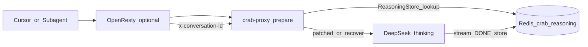

# ReasoningStore 与稳定会话 scope

本文说明 CrabCache 如何用 **ReasoningStore**（Redis 或 SQLite 双后端）缓存 DeepSeek `reasoning_content`，以及 **稳定会话 scope**（`x-conversation-id` / `prompt_cache_key` / `req:hash`）如何减少 `recover` 与 Cursor 子代理重复 notice。

相关文档：[PERSISTENCE.md](./PERSISTENCE.md)、[CURSOR_SETUP.md](./CURSOR_SETUP.md)、[deploy-1panel-openresty.md](./deploy-1panel-openresty.md)。

## 架构



| 存储 | 键前缀 | 内容 |
|------|--------|------|
| ReasoningStore | `crab:reasoning:` | `reasoning` 文本 + 消息 JSON + `created_at` |
| L1 精确缓存 | `cache:` | 整段 JSON/SSE 响应（与 Reasoning 无关） |

## 配置

```toml
[reasoning]
backend = "redis"
redis_url = "redis://127.0.0.1:6379"
thinking_mode = "enabled"
missing_reasoning_strategy = "recover"
# 与 deepseek-cursor-proxy 一致：recover | reject（仅 reject 返回 409）
cache_max_age_secs = 2592000
cache_max_rows = 100000
max_reasoning_entry_bytes = 524288
```

`cache_max_rows`（默认 100000）：

- **SQLite**：表行数上限，超限删最旧行。
- **Redis**：后台任务每 5 分钟 `SCAN crab:reasoning:*`，按 `created_at` 删最旧条目直至低于上限；与 `cache_max_age_secs` TTL 并存。

环境变量覆盖：

| 变量 | 说明 |
|------|------|
| `CRABCACHE_REASONING_BACKEND` | `redis` 或 `sqlite`（多实例 / Docker 用 `redis`） |
| `CRABCACHE_L1_REDIS_URL` | `redis_url` 为空时复用 |

## 稳定 scope 优先级

网关在 [`crates/crab-proxy/src/proxy.rs`](../crates/crab-proxy/src/proxy.rs) 选择 ReasoningStore scope，[`resolve_reasoning_scope`](../crates/crab-reasoning/src/keys.rs) 生成 Redis 逻辑键：

| 优先级 | 来源 | Redis scope 示例 | 适用场景 |
|--------|------|------------------|----------|
| 1 | `x-conversation-id` 或 body `conversation_id` | `session:cursor-thread-1:ns:abc...` | 同一线程多轮追加 |
| 2 | `prompt_cache_key` / `x-prompt-cache-key` | `session:pck:agent-1:ns:...` | Agent 固定缓存键 |
| 3 | 请求体 SHA256 前 16 位 | `session:req:a1b2c3d4:ns:...` | **相同 body** 子代理重试 |
| 4 | （无上述）消息哈希 | `scope:<hash>:signature:...` | 历史一变键就变，最难命中 |

逻辑键示例：

```text
crab:reasoning:scope:session:<id>:ns:<namespace16>:signature:<msg_sha256>
crab:reasoning:namespace:<ns>:turn:<turn_sig>:tool_call:<id>
```

`namespace` 由上游 URL、模型族、thinking、reasoning_effort、授权哈希组成，避免跨租户串键。

**`client:<sk-cc>`**（无会话头时自动）：同 API Key 多轮共享 Store。

有稳定 scope 时：**禁止** `latest_user` 截断；缺 `reasoning_content` 时 **就地补全**（Store → 占位符 `.`），保留 tool 历史。

## 请求处理顺序（recover，默认，对齐 deepseek-cursor-proxy）

1. 剥离入站 recovery notice（防 Cursor 回写触发 boundary）
2. `normalize_messages`：ReasoningStore **fill**
3. **有稳定 scope 且仍缺**：就地 patch（不截断历史）
4. **无稳定 scope 且仍缺**：`recover` 循环（boundary + `latest_user`，与 proxy 一致）
5. 仍缺：仅 **`reject`** 返回 **409**
4. 上游响应流式结束：写入 ReasoningStore（`[DONE]` 及中途 tool 就绪）

## 运维 API

```bash
# 查看运行时策略（无需重启）
curl -s "http://127.0.0.1:9080/v1/runtime/reasoning" \
  -H "x-gateway-admin-key: ${CRABCACHE_GATEWAY_ADMIN_KEY}"

# 热更新为 Cursor 推荐
curl -s -X PUT "http://127.0.0.1:9080/v1/runtime/reasoning" \
  -H "x-gateway-admin-key: ${CRABCACHE_GATEWAY_ADMIN_KEY}" \
  -H "Content-Type: application/json" \
  -d '{"missing_reasoning_strategy":"recover","display_reasoning":true}'

# 清空 ReasoningStore（排障后让下一轮重新写入）
curl -s -X DELETE "http://127.0.0.1:9080/v1/reasoning/cache" \
  -H "x-gateway-admin-key: ${CRABCACHE_GATEWAY_ADMIN_KEY}"
```

## 部署检查清单

| # | 检查项 | 命令 / 预期 |
|---|--------|-------------|
| 1 | Redis 可达 | `redis-cli -u redis://127.0.0.1:6379 PING` → `PONG` |
| 2 | Reasoning 后端 | `GET /v1/runtime/reasoning` → `backend` 为 redis（或 env `CRABCACHE_REASONING_BACKEND=redis`） |
| 3 | 策略 | `missing_reasoning_strategy` = `recover` 或 `reject` |
| 4 | 网关二进制 | 含 `resolve_reasoning_scope` + `req:hash` 回退（重建 `docker compose build gateway`） |
| 5 | 清脏数据 | `DELETE /v1/reasoning/cache`；升级后建议 `POST /v1/cache/invalidate` scope=all |
| 6 | OpenResty（推荐） | API `location` 注入稳定 `x-conversation-id`（见 [deploy-1panel-openresty.md](./deploy-1panel-openresty.md)） |
| 7 | 验收脚本 | `VERIFY_REASONING=1 bash scripts/verify_deployment.sh` 或 `bash scripts/verify_reasoning_store.sh` |

## 日志与 Prometheus

**结构化日志** `Prepared upstream request`：

| 字段 | 理想（Store 命中） |
|------|-------------------|
| `patched` | > 0 |
| `recovered` | 0 |
| `missing` | 0 |
| `stable_session_kind` | `conversation` 或 `prompt_cache_key`（优于 `req_hash`） |

**指标**（`metrics_addr`）：

```text
gateway_reasoning_store_lookups_total{result="hit"}
gateway_reasoning_store_lookups_total{result="miss"}
```

## OpenResty 注入 `x-conversation-id`

Cursor 常不带会话头。可在反代层注入稳定 ID，见 [`deploy/nginx/crabcache-openresty-1panel.example.conf`](../deploy/nginx/crabcache-openresty-1panel.example.conf) 注释示例。未注入时网关仍用 `req:<hash>` 兜底（仅对**完全相同**请求体有效）。

## 验收

```bash
export CLIENT_API_KEY=sk-cc-...
export CRABCACHE_GATEWAY_ADMIN_KEY=...
bash scripts/verify_reasoning_store.sh
```

或：

```bash
VERIFY_REASONING=1 bash scripts/verify_deployment.sh
```

## 故障对照

| 现象 | 可能原因 | 处理 |
|------|----------|------|
| 重复 `[crabcache] Refreshed...` | 子代理并发、Store 未写入前重试 | Redis + `x-conversation-id`；避免并行相同任务 |
| 网关 409 `missing_reasoning_content` | fill + recover 仍补不齐 | 清 Reasoning 缓存；先发一笔成功对话再开子代理 |
| DeepSeek `must be passed back` | 旧网关裸发缺失历史 | 升级网关；勿在 fill 失败时清空 missing 转发 |
| `stable_session_kind=req_hash` 长期不变 | 无会话头、仅相同 body 重试 | OpenResty 注入 `x-conversation-id` |
