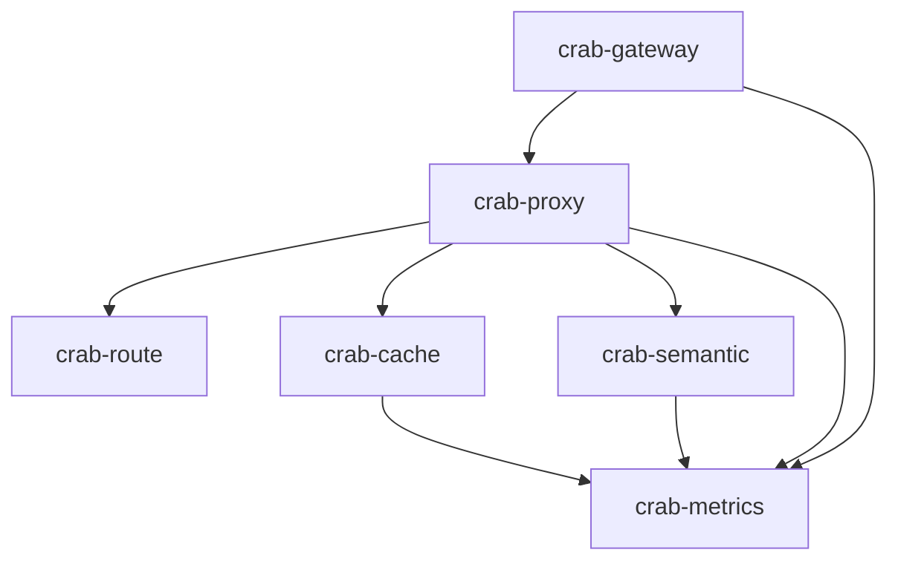

# CrabCache — DeepSeek V4 高性能 Rust API 网关架构设计

基于《面向 DeepSeek V4 的高性能 Rust API 网关全链路生产级方案》，设计 Cargo Workspace 多 crate 项目架构。

## 项目总览

```
CrabCache/
├── Cargo.toml                  # Workspace root
├── config/                     # 运行时配置文件
│   ├── gateway.toml
│   └── gateway.example.toml
├── models/                     # ONNX 模型文件
│   └── all-MiniLM-L6-v2.onnx
├── docker/
│   ├── Dockerfile
│   └── docker-compose.yml
├── crates/
│   ├── crab-gateway/           # 主入口 (Pingora 服务)
│   ├── crab-proxy/             # ProxyHttp 实现 & SSE 处理
│   ├── crab-route/             # Ketama 一致性哈希路由
│   ├── crab-cache/             # L0/L1 多级精确缓存
│   ├── crab-semantic/          # L2 语义缓存 (ort + Qdrant)
│   └── crab-metrics/           # Prometheus 可观测性
└── tests/                      # 集成测试
```

---

## Workspace Cargo.toml

```toml
[workspace]
resolver = "2"
members = [
    "crates/crab-gateway",
    "crates/crab-proxy",
    "crates/crab-route",
    "crates/crab-cache",
    "crates/crab-semantic",
    "crates/crab-metrics",
]

[workspace.dependencies]
# Pingora 核心
pingora          = "0.8"
pingora-proxy    = "0.8"
pingora-core     = "0.8"
pingora-ketama   = "0.8"

# 异步运行时
tokio = { version = "1", features = ["full"] }

# 缓存
oxcache = "0.2"
moka    = { version = "0.12", features = ["future"] }
redis   = { version = "0.27", features = ["tokio-comp", "connection-manager"] }
bb8     = "0.8"
bb8-redis = "0.17"

# 语义缓存
ort            = { version = "2", features = ["load-dynamic"] }
qdrant-client  = "1"
tokenizers     = "0.21"

# 序列化 & 配置
serde      = { version = "1", features = ["derive"] }
serde_json = "1"
toml       = "0.8"

# 可观测性
prometheus       = "0.13"
pingora-limits   = "0.8"

# 工具
bytes      = "1"
anyhow     = "1"
thiserror  = "2"
tracing            = "0.1"
tracing-subscriber = "0.3"
dashmap    = "6"
async-trait = "0.1"
uuid       = { version = "1", features = ["v4"] }

# 内存分配器
jemallocator = "0.5"
```

---

## 各 Crate 详细设计

### 1. `crab-gateway` — 主入口服务

> 职责：启动 Pingora Server、加载配置、组装各模块、挂载 Prometheus 端口

```
crates/crab-gateway/
├── Cargo.toml
└── src/
    ├── main.rs          # 入口: jemalloc 注入, Server 构建
    └── config.rs        # 配置结构体反序列化 (gateway.toml)
```

**`main.rs` 核心流程：**
1. 注入 `#[global_allocator] jemalloc`
2. 加载 `config/gateway.toml` → `GatewayConfig`
3. 初始化 `tracing_subscriber`
4. 构建 `pingora::server::Server`
5. 创建 `CrabProxy`（来自 `crab-proxy`），注入 cache / route / semantic / metrics
6. `server.add_service(http_proxy_service)` 绑定 `0.0.0.0:8080`
7. `server.add_service(prometheus_http_service)` 绑定 `0.0.0.0:9090`
8. `server.run_forever()`

**`config.rs` 配置结构：**
```rust
pub struct GatewayConfig {
    pub listen_addr: String,          // "0.0.0.0:8080"
    pub metrics_addr: String,         // "0.0.0.0:9090"
    pub upstream: UpstreamConfig,
    pub cache: CacheConfig,
    pub semantic: SemanticConfig,
}

pub struct UpstreamConfig {
    pub deepseek_endpoints: Vec<EndpointEntry>,  // host, port, weight
    pub tls_sni: String,
    pub api_keys: Vec<String>,
}

pub struct CacheConfig {
    pub l0_max_entries: u64,
    pub l0_ttl_secs: u64,
    pub redis_url: String,
    pub redis_pool_size: u32,
    pub l1_ttl_secs: u64,
}

pub struct SemanticConfig {
    pub enabled: bool,
    pub onnx_model_path: String,
    pub qdrant_url: String,
    pub collection_name: String,
    pub similarity_threshold: f32,   // 0.95
}
```

---

### 2. `crab-proxy` — ProxyHttp 实现 & SSE 流处理

> 职责：实现 Pingora `ProxyHttp` trait，管理请求全生命周期，SSE 旁路拦截

```
crates/crab-proxy/
├── Cargo.toml
└── src/
    ├── lib.rs
    ├── proxy.rs        # ProxyHttp trait 实现
    ├── context.rs      # 请求级上下文 (CTX)
    └── sse.rs          # SSE 流式响应解析 & 缓冲
```

**核心结构：**
```rust
// context.rs
pub struct RequestContext {
    pub request_id: String,
    pub conversation_id: Option<String>,
    pub user_id: Option<String>,
    pub cache_key: Option<String>,
    pub body_buffer: Vec<u8>,           // 请求体缓冲
    pub response_chunks: Vec<Bytes>,    // SSE 旁路收集
    pub cache_hit_tier: Option<CacheTier>,
    pub start_time: Instant,
    pub first_token_time: Option<Instant>,
}

// proxy.rs — ProxyHttp 生命周期
impl ProxyHttp for CrabProxy {
    type CTX = RequestContext;

    fn new_ctx(&self) -> Self::CTX { ... }

    // 1. 请求过滤: 认证校验, 提取 cache_key
    async fn request_filter(&self, session, ctx) -> Result<bool> { ... }

    // 2. 缓存查询: L0 → L1 → L2(语义), 命中则直接返回
    async fn upstream_request_filter(&self, session, upstream_req, ctx) { ... }

    // 3. 路由选择: Ketama 一致性哈希
    async fn upstream_peer(&self, session, ctx) -> Result<Box<HttpPeer>> { ... }

    // 4. SSE 旁路拦截: 克隆 chunk 到 ctx, 不阻塞下发
    fn response_body_filter(&self, session, body, eof, ctx) -> Result<Option<Duration>> { ... }

    // 5. 响应完成: 解析 usage, 回填缓存, 上报 metrics
    async fn logging(&self, session, error, ctx) { ... }
}
```

---

### 3. `crab-route` — Ketama 一致性哈希路由

> 职责：管理上游节点环，基于会话亲和性做路由决策

```
crates/crab-route/
├── Cargo.toml
└── src/
    ├── lib.rs
    ├── ring.rs         # Ketama 哈希环封装
    └── affinity.rs     # 亲和性键提取策略
```

**核心 API：**
```rust
pub struct AffinityRouter {
    ring: pingora_ketama::Continuum,
    backends: Vec<Backend>,
}

impl AffinityRouter {
    pub fn new(backends: &[BackendConfig]) -> Self;

    /// 从请求中提取亲和性键: x-conversation-id > user_id > client_ip
    pub fn extract_key(session: &Session) -> String;

    /// 路由到目标后端
    pub fn select(&self, key: &str) -> &Backend;

    /// 动态更新后端列表 (热重载)
    pub fn update_backends(&mut self, backends: &[BackendConfig]);
}
```

---

### 4. `crab-cache` — L0/L1 多级精确缓存 + 防击穿

> 职责：基于 oxcache 的两级缓存，Moka(L0) + Redis(L1)，含 Request Coalescing

```
crates/crab-cache/
├── Cargo.toml
└── src/
    ├── lib.rs
    ├── key.rs          # CacheKey 生成 (请求体规范化 + SHA256)
    ├── tiered.rs       # oxcache 多级缓存协调器
    ├── coalescing.rs   # 请求合并 (DashMap + Mutex 防击穿)
    └── types.rs        # CacheEntry, CacheTier 枚举
```

**核心 API：**
```rust
pub struct TieredCache {
    l0: moka::future::Cache<String, CacheEntry>,
    l1: bb8::Pool<bb8_redis::RedisConnectionManager>,
    inflight: DashMap<String, Arc<Notify>>,  // Request Coalescing
}

impl TieredCache {
    pub async fn get(&self, key: &str) -> Option<(CacheEntry, CacheTier)>;
    pub async fn put(&self, key: &str, entry: CacheEntry) -> Result<()>;
    pub async fn get_or_fetch<F>(&self, key: &str, fetch: F) -> Result<CacheEntry>
    where F: Future<Output = Result<CacheEntry>>;  // 防击穿核心
}

pub struct CacheEntry {
    pub response_body: Bytes,
    pub model: String,
    pub usage: UsageInfo,
    pub created_at: u64,
}

pub enum CacheTier { L0Moka, L1Redis, L2Semantic, Miss }
```

---

### 5. `crab-semantic` — L2 语义缓存

> 职责：ort 推理嵌入向量 + Qdrant 相似度检索

```
crates/crab-semantic/
├── Cargo.toml
└── src/
    ├── lib.rs
    ├── embedder.rs     # ort ONNX 推理引擎封装
    ├── store.rs        # Qdrant 向量存储 CRUD
    └── cache.rs        # 语义缓存查询/写入协调
```

**核心 API：**
```rust
pub struct Embedder {
    session: ort::Session,          // all-MiniLM-L6-v2
    tokenizer: tokenizers::Tokenizer,
}

impl Embedder {
    /// 在 spawn_blocking 中执行, 不阻塞事件循环
    pub async fn embed(&self, text: &str) -> Result<Vec<f32>>;
}

pub struct SemanticCache {
    embedder: Arc<Embedder>,
    qdrant: qdrant_client::Qdrant,
    collection: String,
    threshold: f32,
}

impl SemanticCache {
    pub async fn search(&self, query: &str) -> Option<CacheEntry>;
    pub async fn insert(&self, query: &str, entry: &CacheEntry) -> Result<()>;
}
```

---

### 6. `crab-metrics` — Prometheus 可观测性

> 职责：定义 AI 业务指标，Token 成本追踪，延迟直方图

```
crates/crab-metrics/
├── Cargo.toml
└── src/
    ├── lib.rs
    └── registry.rs     # 全局指标注册 & 上报方法
```

**指标定义：**
```rust
pub struct GatewayMetrics {
    // LLM Token 财务指标
    pub input_tokens: IntCounterVec,    // labels: cache_status, model, consumer
    pub output_tokens: IntCounterVec,

    // 多层缓存效能
    pub cache_requests: IntCounterVec,  // labels: tier, result

    // QoS 延迟
    pub upstream_latency: HistogramVec,
    pub ttft: HistogramVec,             // Time To First Token
    pub cache_fetch_latency: HistogramVec,

    // 语义缓存
    pub semantic_requests: IntCounterVec,
}

impl GatewayMetrics {
    pub fn new() -> Self;  // 注册到全局 prometheus::Registry
    pub fn record_cache_hit(&self, tier: CacheTier, model: &str, consumer: &str);
    pub fn record_upstream_usage(&self, usage: &UsageInfo, model: &str, consumer: &str);
    pub fn record_latency(&self, metric: LatencyKind, duration: Duration);
}
```

---

## 依赖关系图



---

## 数据流

```
Client Request
  │
  ▼
┌─────────────────┐
│  crab-gateway    │  Pingora Server 入口
└────────┬────────┘
         ▼
┌─────────────────┐
│  crab-proxy      │  request_filter: 认证 & 提取 cache_key
│  (ProxyHttp)     │
│                  │──► crab-cache.get(key)
│                  │    ├─ L0 Moka 命中 → 直接返回 (P99<100ns)
│                  │    ├─ L1 Redis 命中 → 直接返回 (P99<5ms)
│                  │    └─ Miss
│                  │         │
│                  │         ▼
│                  │──► crab-semantic.search(query)
│                  │    ├─ cos_sim ≥ 0.95 → 返回缓存
│                  │    └─ Miss
│                  │         │
│                  │         ▼
│                  │──► crab-route.select(affinity_key)
│                  │    └─ Ketama 哈希环 → 选定 upstream
│                  │         │
│                  │         ▼
│                  │    DeepSeek V4 API (SSE 流式)
│                  │         │
│                  │    response_body_filter: 旁路克隆 chunks
│                  │         │
│                  │    logging: 解析 usage → 回填缓存 → 上报指标
└─────────────────┘
         │
         ▼
┌─────────────────┐
│  crab-metrics    │──► Prometheus :9090 /metrics
└─────────────────┘
```

---

## Docker 部署架构

```yaml
# docker-compose.yml 核心服务
services:
  crab-gateway:      # Pingora 网关 x2-3 实例, 4C/4G
    image: crabcache:latest
    ports: ["8080:8080", "9090:9090"]

  redis:             # L1 精确缓存, 1GB, LRU
    image: redis:7-alpine

  qdrant:            # L2 语义向量库, 2GB
    image: qdrant/qdrant:latest

  prometheus:        # 指标采集
    image: prom/prometheus:latest

  grafana:           # 可视化看板
    image: grafana/grafana:latest
```

---

## User Review Required

> [!IMPORTANT]
> **部署平台限制**：根据方案文档，Pingora SSE 流式响应在 macOS 上存在已知 Bug (Issue #841)。生产环境必须运行于 Linux 内核，开发调试需使用 Docker 容器。

> [!IMPORTANT]
> **ONNX 模型文件**：`all-MiniLM-L6-v2.onnx` 需要从 Hugging Face 下载并放置到 `models/` 目录，体积约 80MB，不应提交到 Git。

## Open Questions

1. **API Key 管理**：是否需要支持多租户 API Key 映射（多个消费者各自的 DeepSeek Key），还是单一共享 Key？
2. **语义缓存优先级**：语义缓存（L2）在一期就实现，还是按文档所述放在二期？
3. **配置热重载**：后端节点列表变更时，是否需要支持不重启的热重载？
4. **缓存 TTL 策略**：精确缓存的 TTL 是否需要按 model/consumer 维度差异化配置？

## Verification Plan

### Automated Tests
- 各 crate 单元测试：`cargo test --workspace`
- `crab-cache`：使用 mock Redis 测试 L0→L1 降级 & Request Coalescing
- `crab-route`：验证 Ketama 哈希环节点增删后的漂移率 < K/N
- `crab-proxy`：mock upstream 测试 SSE 旁路拦截完整性

### Build Verification
- `cargo build --release` 确保全量编译通过
- `cargo clippy --workspace` 无警告
- Docker 镜像构建验证

### Integration Tests
- Docker Compose 启动全栈，使用 `curl` 发送 SSE 请求验证端到端流式响应
- 同一 conversation_id 多次请求验证路由亲和性（同一后端）
- 相同请求验证 L0/L1 缓存命中
