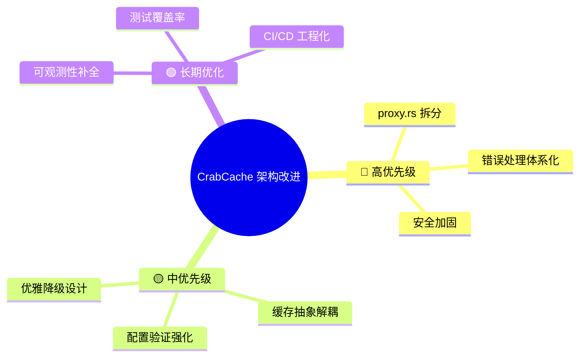
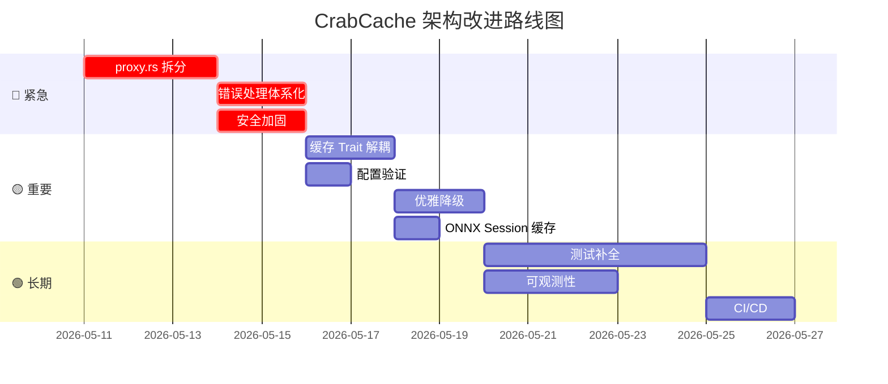

# CrabCache 项目架构改进建议

> 基于对 9 个 crate、~50 个源文件的完整审查，以下按 **优先级 × 影响面** 排列改进建议。

---

## 总览



---

## 1. 🔴 `proxy.rs` 上帝对象拆分 — 最关键

### 问题诊断

[proxy.rs](file:///c:/Users/smile/Desktop/trae/CrabCache/crates/crab-proxy/src/proxy.rs) 当前 **897 行**，`upstream_response_body_filter` 方法独占 ~300 行，混杂了：

- 缓存查询 / 回填逻辑（精确缓存 + 语义缓存）
- SSE 流解析和 usage 提取
- 推理内容改写 (`crab-reasoning`)
- 请求合并 (coalescing) 
- 指标上报

> [!CAUTION]
> 单方法 300 行严重违反 **单一职责原则**，任何缓存逻辑变更都有回归风险。

### 核心代码味道

1. **缓存命中响应逻辑重复 4 次**（L0/L1 命中、L2 语义命中、follower 命中、streaming 命中），每次都手动构建 header + 写 body：

```rust
// 这段逻辑在 proxy.rs 中出现了 4 次，仅细节不同
if is_stream {
    let sse_body = json_to_sse_stream(&response_body, &ctx.model);
    let header = build_sse_response_header(sse_body.len());
    session.downstream_session.write_response_header(...).await;
    session.downstream_session.write_response_body(...).await;
} else {
    let header = build_json_response_header(response_body.len());
    session.downstream_session.write_response_header(...).await;
    session.downstream_session.write_response_body(...).await;
}
```

2. **CacheEntry 构造重复 4 次**，每次手动获取 timestamp：

```rust
// 重复 4 次
let entry = CacheEntry {
    response_body: ctx.accumulated_body.clone(),
    model: ctx.model.clone(),
    usage: UsageInfo::default(),  // ⚠️ usage 永远是 default！
    created_at: std::time::SystemTime::now()
        .duration_since(std::time::UNIX_EPOCH)
        .unwrap_or_default()
        .as_secs(),
    ttl_secs: 3600,  // ⚠️ 硬编码，未使用 TtlConfig
};
```

### 改进方案

```
crab-proxy/src/
├── proxy.rs           # ProxyHttp trait 实现（~150 行骨架）
├── cache_handler.rs   # 缓存查询 + 响应下发
├── cache_writer.rs    # 缓存回填（精确 + 语义）
├── response_filter.rs # SSE 旁路收集 + usage 提取
├── auth.rs            # 认证 + API key 轮询
├── context.rs         # 不变
└── sse.rs             # 不变
```

```rust
// cache_handler.rs — 消除重复
pub async fn send_cached_response(
    session: &mut Session,
    entry: &CacheEntry,
    is_streaming: bool,
    model: &str,
) -> Result<()> {
    let (content_type, body) = if is_streaming {
        ("text/event-stream", json_to_sse_stream(&entry.response_body, model))
    } else {
        ("application/json", entry.response_body.clone())
    };
    let header = build_response_header(content_type, body.len());
    session.downstream_session.write_response_header(Box::new(header)).await?;
    session.downstream_session.write_response_body(Bytes::from(body), true).await?;
    Ok(())
}
```

---

## 2. 🔴 错误处理体系化

### 问题诊断

当前大量使用 `let _ = ...` 吞掉错误：

```rust
// proxy.rs 中出现 12 次
let _ = session.respond_error(401).await;
let _ = session.downstream_session.write_response_header(...).await;
let _ = session.downstream_session.write_response_body(...).await;
```

> [!WARNING]
> 响应头/体写入失败被静默忽略。在客户端突然断连时，这些错误会悄悄丢失，导致缓存回填执行在错误状态下继续。

### 改进方案

#### 2.1 引入项目级错误类型

```rust
// crates/crab-proxy/src/error.rs
#[derive(Debug, thiserror::Error)]
pub enum ProxyError {
    #[error("Cache lookup failed: {0}")]
    CacheLookup(#[source] anyhow::Error),
    
    #[error("Downstream write failed: {0}")]
    DownstreamWrite(#[source] pingora_core::Error),
    
    #[error("Upstream connection failed: {0}")]
    UpstreamConnect(#[source] pingora_core::Error),
    
    #[error("Request body parse failed")]
    InvalidBody,
    
    #[error("Authentication failed")]
    Unauthorized,
}
```

#### 2.2 对不可恢复的下游写入使用 `?`

```rust
// 替换 let _ = ...
session.downstream_session
    .write_response_header(Box::new(header))
    .await
    .map_err(|e| {
        warn!(error = %e, "Failed to write cached response header");
        Error::new(ErrorType::WriteError)
    })?;
```

---

## 3. 🔴 安全加固

### 3.1 API Key 明文存储

> [!CAUTION]
> [config.rs](file:///c:/Users/smile/Desktop/trae/CrabCache/crates/crab-gateway/src/config.rs) 中 `api_key: String` 以明文存储在配置文件中。Admin API 的 `get_upstream_config` 甚至在响应中返回 `api_key` 全文：

```rust
// routes.rs:564-568 — 返回完整 API key！
Json(UpstreamConfig {
    base_url: config.base_url,
    api_key: config.api_key.clone(),  // ⚠️ 完整 key 暴露
    api_key_masked,
    endpoints: config.endpoints,
})
```

### 改进方案

```rust
// 1. 仅返回掩码版本
Json(UpstreamConfig {
    base_url: config.base_url,
    api_key: mask_api_key(&config.api_key),  // 只返回掩码
    endpoints: config.endpoints,
})

// 2. 支持环境变量注入
pub fn load(path: &str) -> Result<Self> {
    let mut config: Self = toml::from_str(&content)?;
    // 环境变量优先
    if let Ok(key) = std::env::var("CRABCACHE_API_KEY") {
        config.api_key = key;
    }
    Ok(config)
}

// 3. 敏感字段实现 Debug 脱敏
pub struct SecretString(String);
impl std::fmt::Debug for SecretString {
    fn fmt(&self, f: &mut std::fmt::Formatter) -> std::fmt::Result {
        write!(f, "****")
    }
}
```

### 3.2 Admin API 无认证

[routes.rs](file:///c:/Users/smile/Desktop/trae/CrabCache/crates/crab-admin/src/routes.rs) 的所有管理端点 `/api/admin/*` **完全无认证**，任何人都可以：
- 创建/删除 API Key
- 修改缓存配置
- 查看完整请求日志

**改进**：添加 `Authorization` 中间件或 Basic Auth。

---

## 4. 🟡 缓存层引入 Trait 解耦

### 问题诊断

`TieredCache` 直接硬编码 Moka + Redis，无法：
- 单元测试中 mock Redis
- 替换为其他分布式缓存（如 Memcached）
- 独立测试各层逻辑

### 改进方案

```rust
// crates/crab-cache/src/store.rs
#[async_trait]
pub trait CacheStore: Send + Sync {
    async fn get(&self, key: &str) -> Option<CacheEntry>;
    async fn put(&self, key: &str, entry: &CacheEntry, ttl_secs: u64) -> Result<()>;
    async fn delete(&self, key: &str) -> Result<()>;
}

// L0 实现
pub struct MokaStore { cache: moka::future::Cache<String, CacheEntry> }

#[async_trait]
impl CacheStore for MokaStore { /* ... */ }

// L1 实现
pub struct RedisStore { pool: Pool<RedisConnectionManager> }

#[async_trait]
impl CacheStore for RedisStore { /* ... */ }

// 测试用 mock
#[cfg(test)]
pub struct InMemoryStore { map: DashMap<String, CacheEntry> }

// TieredCache 基于 trait 组合
pub struct TieredCache {
    l0: Box<dyn CacheStore>,
    l1: Box<dyn CacheStore>,
    ttl_config: TtlConfig,
}
```

---

## 5. 🟡 配置验证强化

### 问题诊断

[config.rs](file:///c:/Users/smile/Desktop/trae/CrabCache/crates/crab-gateway/src/config.rs#L87-L106) 的 `parse_endpoints` 对无效地址直接 `panic!`：

```rust
let addr: SocketAddr = endpoint
    .parse()
    .unwrap_or_else(|_| {
        panic!("Invalid endpoint address: {}", endpoint)  // ⚠️ 启动 panic
    });
```

配置文件中 `listen_addr` 和 `metrics_addr` 缺乏格式校验。`tls_sni` 硬编码为 `"api.deepseek.com"`：

```rust
crab_route::Backend::new(
    format!("backend-{}", i + 1),
    addr,
    self.upstream.default_weight.unwrap_or(1),
    "api.deepseek.com".to_string(),  // ⚠️ 硬编码
)
```

### 改进方案

```rust
impl GatewayConfig {
    pub fn validate(&self) -> Result<(), Vec<String>> {
        let mut errors = Vec::new();
        
        if self.api_key.is_empty() || self.api_key.starts_with("sk-your-") {
            errors.push("api_key is not configured".into());
        }
        
        if self.upstream.deepseek_endpoints.is_empty() {
            errors.push("At least one upstream endpoint is required".into());
        }
        
        for ep in &self.upstream.deepseek_endpoints {
            if ep.parse::<SocketAddr>().is_err() {
                errors.push(format!("Invalid endpoint: {}", ep));
            }
        }
        
        if let Some(threshold) = self.semantic.similarity_threshold {
            if !(0.0..=1.0).contains(&threshold) {
                errors.push("similarity_threshold must be in [0.0, 1.0]".into());
            }
        }
        
        if errors.is_empty() { Ok(()) } else { Err(errors) }
    }
}
```

---

## 6. 🟡 优雅降级与韧性设计

### 6.1 Redis 故障无降级

当前 `TieredCache::get()` 中 Redis 连接失败 → 整体返回 `None`（缓存 miss），但 **L0（Moka）的结果被丢弃了**：

```rust
// tiered.rs:42 — Redis 失败导致 L0 命中也丢失
let mut conn = self.l1_pool.get().await.ok()?;  // ⚠️ 这里 ? 会短路
```

**改进**：Redis 失败时仅降级 L1，不影响 L0 命中：

```rust
pub async fn get(&self, key: &str) -> Option<(CacheEntry, CacheTier)> {
    // L0 查询
    if let Some(entry) = self.l0.get(key).await {
        return Some((entry, CacheTier::L0Moka));
    }
    
    // L1 查询 — 失败降级
    match self.try_l1_get(key).await {
        Ok(Some(entry)) => {
            self.l0.insert(key.to_string(), entry.clone()).await;
            return Some((entry, CacheTier::L1Redis));
        }
        Ok(None) => {}
        Err(e) => {
            warn!(error = %e, "L1 Redis degraded, skipping");
            // 继续执行而非短路
        }
    }
    
    None
}
```

### 6.2 Qdrant 故障拖慢请求

语义缓存的向量搜索没有超时控制。如果 Qdrant 无响应，所有请求都会被阻塞。

**改进**：添加 circuit breaker 和超时：

```rust
pub async fn search(&self, query_text: &str) -> Option<CacheEntry> {
    tokio::time::timeout(
        Duration::from_millis(50),  // 语义搜索最多 50ms
        self.do_search(query_text),
    )
    .await
    .ok()
    .flatten()
}
```

### 6.3 请求体大小无限制

[proxy.rs](file:///c:/Users/smile/Desktop/trae/CrabCache/crates/crab-proxy/src/proxy.rs#L108-L117) 无限读取请求体到内存：

```rust
let mut full_body = Vec::new();
loop {
    match session.downstream_session.read_request_body().await? {
        Some(data) => full_body.extend_from_slice(&data),  // ⚠️ 无限制
        None => break,
    }
}
```

**改进**：设置上限（如 10MB）：

```rust
const MAX_BODY_SIZE: usize = 10 * 1024 * 1024;

loop {
    match session.downstream_session.read_request_body().await? {
        Some(data) => {
            full_body.extend_from_slice(&data);
            if full_body.len() > MAX_BODY_SIZE {
                let _ = session.respond_error(413).await;
                return Ok(true);
            }
        }
        None => break,
    }
}
```

---

## 7. 🟢 可观测性补全

### 7.1 Metrics 标签缺失

[registry.rs](file:///c:/Users/smile/Desktop/trae/CrabCache/crates/crab-metrics/src/registry.rs#L210-L231) 中 `record_latency` 方法的 model label 硬编码为 `"unknown"`：

```rust
LatencyKind::Upstream => {
    self.upstream_latency
        .with_label_values(&["unknown"])  // ⚠️ 应传递实际 model
        .observe(duration_secs);
}
```

**改进**：为 `record_latency` 添加 `model: &str` 参数。

### 7.2 缺少关键指标

| 缺少的指标 | 用途 |
|-----------|------|
| `gateway_active_connections` (Gauge) | 当前活跃连接数 |
| `gateway_request_body_size_bytes` (Histogram) | 请求体大小分布 |
| `gateway_cache_backfill_errors_total` | 缓存回填失败次数 |
| `gateway_coalescer_inflight_total` (Gauge) | 当前合并等待中的请求 |
| `gateway_request_duration_seconds` (Histogram) | 端到端请求耗时 |

### 7.3 结构化日志缺少 Trace ID

当前日志没有 OpenTelemetry 兼容的 trace context。生产环境中无法跨服务追踪。

---

## 8. 🟢 测试覆盖率提升

### 当前状态

| Crate | 测试文件 | 覆盖范围 |
|-------|---------|---------|
| `crab-metrics` | ✅ 基础断言 | enum 转换、注册、记录 |
| `crab-route` | ✅ 较完善 | 一致性路由、漂移率 |
| `crab-cache` | ✅ coalescing/types | TTL 优先级、leader/follower |
| `crab-proxy` | ⚠️ 仅 context 构造 | 无 ProxyHttp 行为测试 |
| `crab-semantic` | ⚠️ 仅文件不存在 | 无推理/搜索测试 |
| `crab-reasoning` | ❌ 无测试 | — |
| `crab-admin` | ❌ 无测试 | — |
| `crab-gateway` | ⚠️ 仅配置失败 | 无启动/集成测试 |

### 关键缺口

1. **`proxy.rs` 无测试**：核心代理逻辑完全依赖集成测试
2. **`crab-reasoning`（75KB 代码）无测试**：normalize.rs (31KB) 和 streaming.rs (14KB) 是高复杂度模块
3. **`crab-admin`（routes.rs 27KB）无测试**：API 端点正确性无保证

### 改进方案

```rust
// 示例：proxy 层的 cache hit 单元测试
#[tokio::test]
async fn test_cache_hit_returns_response() {
    let mock_cache = InMemoryStore::new();
    mock_cache.put("test-key", mock_entry()).await.unwrap();
    
    let state = build_test_state(mock_cache);
    let proxy = GatewayProxy::new(state);
    
    let mut session = MockSession::with_body(json!({
        "model": "deepseek-v4-pro",
        "messages": [{"role": "user", "content": "hello"}]
    }));
    
    let ctx = proxy.new_ctx();
    let filtered = proxy.request_filter(&mut session, &mut ctx).await.unwrap();
    
    assert!(filtered); // 缓存命中应该返回 true（已处理）
    assert!(ctx.cache_hit.is_some());
}
```

---

## 9. 🟢 工程化改进

### 9.1 Dockerfile 问题

[Dockerfile](file:///c:/Users/smile/Desktop/trae/CrabCache/Dockerfile) 使用 `rust:1.85-slim`，但 `Cargo.toml` 声明 `edition = "2024"`。

```dockerfile
FROM rust:1.85-slim AS builder  # ⚠️ 可能不支持 edition 2024
```

并且缺少 `crab-admin`、`crab-reasoning`、`crab-dashboard` 三个 crate 的 Cargo.toml 缓存层：

```dockerfile
# 缺失这三个 crate
COPY crates/crab-admin/Cargo.toml crates/crab-admin/Cargo.toml
COPY crates/crab-reasoning/Cargo.toml crates/crab-reasoning/Cargo.toml
COPY crates/crab-dashboard/Cargo.toml crates/crab-dashboard/Cargo.toml
```

### 9.2 docker-compose.yml 不完整

当前 [docker-compose.yml](file:///c:/Users/smile/Desktop/trae/CrabCache/docker-compose.yml) 缺少 Prometheus 和 Grafana 服务（README 中承诺但未实现），也缺少 `crab-admin` 服务。

### 9.3 缺少 CI/CD

建议添加 GitHub Actions：

```yaml
# .github/workflows/ci.yml
name: CI
on: [push, pull_request]
jobs:
  check:
    runs-on: ubuntu-latest
    steps:
      - uses: actions/checkout@v4
      - uses: dtolnay/rust-toolchain@stable
      - run: cargo check --workspace
      - run: cargo clippy --workspace -- -D warnings
      - run: cargo test --workspace
      - run: cargo fmt --check
```

---

## 10. 其他值得注意的问题

### 10.1 ONNX Session 每次推理重建

[embedder.rs](file:///c:/Users/smile/Desktop/trae/CrabCache/crates/crab-semantic/src/embedder.rs#L46-L48) 在每次 `embed()` 调用时重新创建 ONNX Session：

```rust
let result = tokio::task::spawn_blocking(move || -> Result<Vec<f32>> {
    let mut session = ort::session::Session::builder()?
        .commit_from_file(&model_path)?;  // ⚠️ 每次调用都加载模型！
```

**改进**：在 `Embedder::load` 时一次性创建 Session，存储为字段：

```rust
pub struct Embedder {
    session: Arc<ort::Session>,
    tokenizer: Tokenizer,
}
```

### 10.2 CacheEntry.usage 始终为 default

[proxy.rs](file:///c:/Users/smile/Desktop/trae/CrabCache/crates/crab-proxy/src/proxy.rs#L544) 构造 `CacheEntry` 时 `usage: UsageInfo::default()`，即使上面已经解析到了真实 usage 数据也不填入。这导致缓存条目中丢失 token 用量信息。

### 10.3 `response_body_filter` 双重 usage 解析

[proxy.rs L450-L486](file:///c:/Users/smile/Desktop/trae/CrabCache/crates/crab-proxy/src/proxy.rs#L450-L486) 中同一个 chunk 被 `rewrite_sse_chunk` 和 `parse_sse_chunk` 分别解析 usage，可能导致 **token 计数重复翻倍**。

### 10.4 `GatewayContext` 过于膨胀

[context.rs](file:///c:/Users/smile/Desktop/trae/CrabCache/crates/crab-proxy/src/context.rs#L66-L121) 有 **25 个字段**，大部分为 `Option`。建议按关注点分组：

```rust
pub struct GatewayContext {
    pub identity: RequestIdentity,     // request_id, consumer, conversation_id, auth
    pub cache: CacheState,             // cache_key, cache_hit, coalesce_guard
    pub timing: TimingState,           // request_start, upstream_start, ttft
    pub body: BodyState,               // accumulated_body, original_request_body, new_request_body
    pub reasoning: ReasoningState,     // stream_accumulator, display_adapter, pending_recovery_notice
    pub flags: RequestFlags,           // is_streaming, is_models_list, is_coalesced_follower
}
```

---

## 改进优先级路线图



---

## 总结

| 维度 | 当前评级 | 目标评级 | 关键改进 |
|------|---------|---------|---------|
| **代码质量** | ⭐⭐ | ⭐⭐⭐⭐ | proxy.rs 拆分、消除重复 |
| **错误处理** | ⭐⭐ | ⭐⭐⭐⭐ | 停止吞错误、引入错误类型 |
| **安全性** | ⭐⭐ | ⭐⭐⭐⭐ | Key 脱敏、Admin 认证 |
| **韧性** | ⭐⭐⭐ | ⭐⭐⭐⭐⭐ | Redis 降级、超时控制 |
| **可测试性** | ⭐⭐ | ⭐⭐⭐⭐ | Trait 解耦、mock 支持 |
| **可观测性** | ⭐⭐⭐ | ⭐⭐⭐⭐ | 指标补全、label 修复 |
| **工程化** | ⭐⭐ | ⭐⭐⭐⭐ | CI/CD、Dockerfile 修复 |
| **性能** | ⭐⭐⭐⭐ | ⭐⭐⭐⭐⭐ | ONNX Session 复用、usage 重复解析修复 |
