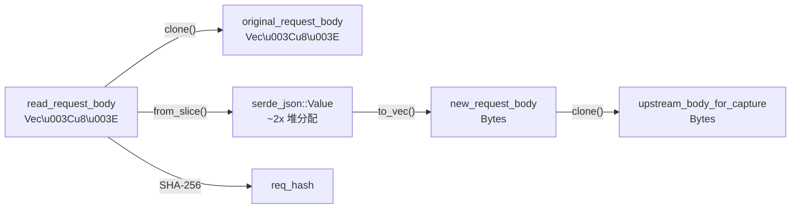
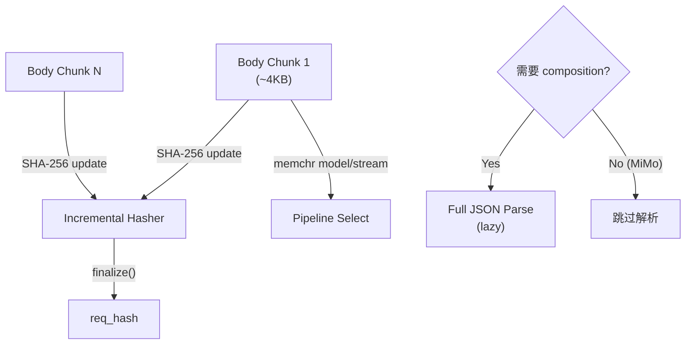
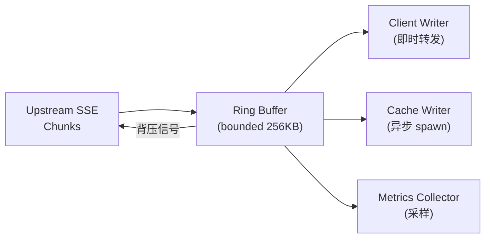
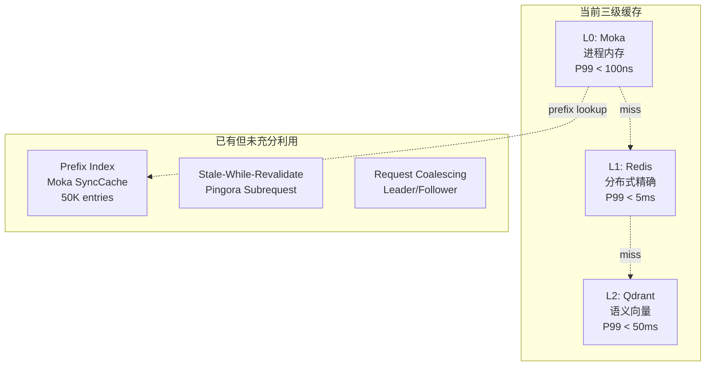
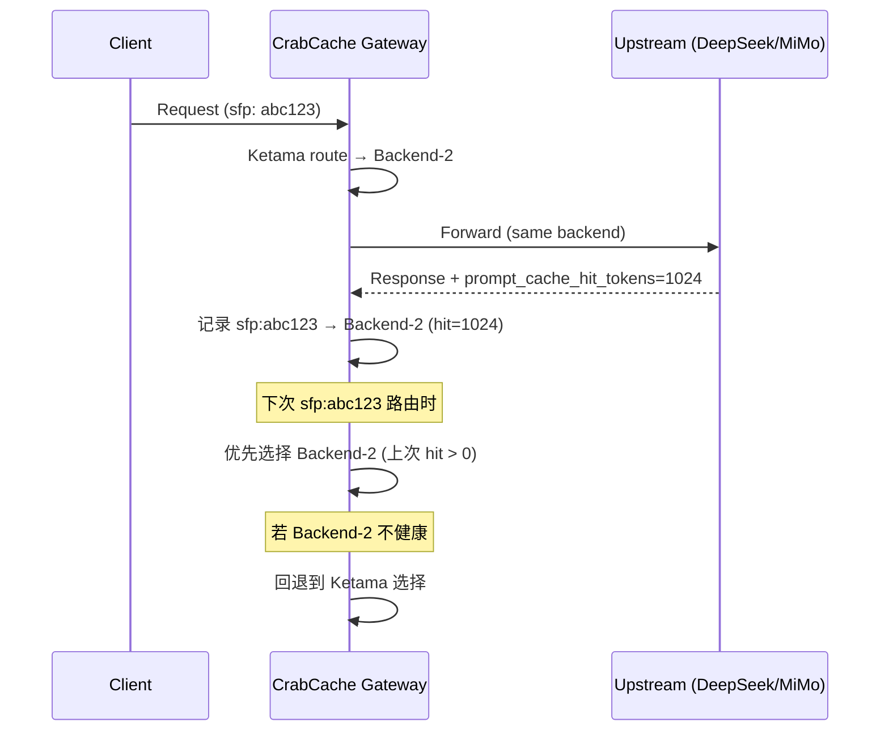

# CrabCache 数据面改进建议与演进方向展望

> **实现状态**：P0–P2 交付对照见 [docs/DATA_PLANE.md](docs/DATA_PLANE.md)（✅/🟡/⬜）。P3 见 [docs/DATA_PLANE_P3.md](docs/DATA_PLANE_P3.md)。  
> **行为勘误**：Prefix L0 命中 = **索引预热、继续上游**（非返回旧响应）；连接预热 = **共享 Connector 直 TCP+TLS**（非 loopback HTTP）。以下正文部分段落为原始展望，以 DATA_PLANE 为准。

## 概要

基于对 CrabCache 16 个 crate 的数据面（data plane）全链路分析，本文从 **请求处理管道**、**SSE 流式引擎**、**缓存架构**、**路由与连接管理**、**可观测性与诊断**、**面向未来的架构演进** 六个维度，提出系统性改进建议和中长期演进方向。

> [!NOTE]
> 本文聚焦数据面（proxy 请求热路径），不覆盖控制面（Management API、Admin Dashboard）和部署运维层面。

---

## 一、请求处理管道：零拷贝化改造

### 1.1 当前技术债务（历史分析 · 2025 初稿）

> **2026 更新**：P0 已落地 `Bytes` 化 `original_request_body`、读 body 时增量 SHA-256、Raw capture 复用 `Arc<Value>`。下表描述改进前基线，供对比量化收益。

从 [proxy.rs](file:///opt/projct/CrabCache/crates/crab-proxy/src/proxy.rs) 的 `request_filter` 阶段分析，每个请求至少经历以下内存复制链：



| 阶段 | 操作 | 2 MB Body 开销 | 4 MB Body 开销 |
|------|------|---------------|---------------|
| Body 读取 + `original_request_body` clone | `Vec<u8>` clone | ~4 MB | ~8 MB |
| JSON parse → `Arc<Value>` | 堆分配 ~1.5x | ~3 MB | ~6 MB |
| `serde_json::to_vec` (prepare) | 序列化 | ~2 MB | ~4 MB |
| `upstream_body_for_capture` | `Bytes` clone (已优化) | O(1) | O(1) |
| **总内存压力** | | **~9 MB** | **~18 MB** |

### 1.2 改进方向

#### Phase 1: `Bytes` 统一替代 `Vec<u8>`（近期） — ✅ 已落地

将 [context.rs](crates/crab-proxy/src/context.rs) 的 `original_request_body` 替换为 `Bytes`（已实现）:

```diff
- pub original_request_body: Option<Vec<u8>>,
+ pub original_request_body: Option<Bytes>,
```

`Bytes` 的 `clone()` 是引用计数递增（O(1)），消除 [proxy.rs L635](file:///opt/projct/CrabCache/crates/crab-proxy/src/proxy.rs#L635) 的 `full_body.clone()` 开销。

**量化目标**: 2 MB body 的 `request_filter` 阶段内存分配从 ~9 MB 降至 ~5 MB（消除 body clone 的 2 MB + 序列化前的中间 Vec）。

#### Phase 2: 增量哈希 + 流式解析（中期） — 🟡 部分

增量 SHA-256 ✅。MiMo **early exact cache** 前可用 `body_quick_parse` 延迟 full parse ✅；其余管道与首 chunk 选 pipeline ⬜。引入 **流式处理**（完整愿景）：

1. **增量 SHA-256**: 在 `read_request_body` 循环中 `hasher.update(&data)` 逐块喂入，body 读完即得哈希，消除额外遍历
2. **模型/stream 快速提取**: 在首个 body chunk（通常 <4KB）中用 `memchr` 搜索 `"model":` 和 `"stream":` 字段，无需完整 JSON 解析即可完成管线选择（pipeline selection）
3. **惰性完整解析**: 仅在需要 composition/reasoning prepare 时才调用 `serde_json::from_slice`



**量化目标**: MiMo 管道（纯透传）的 `request_filter` 延迟从 ~15ms 降至 ~3ms（跳过完整 JSON 解析）。

#### Phase 3: 零拷贝 Body 转发（长期） — ⬜ 未实现

利用 [FeaturesConfig](crates/crab-proxy/src/context.rs) 中已有的 `streaming_body_forward` 开关（配置预留），规划实现：

- 对 MiMo/GenericRelay 等不修改 body 的管道，`request_body_filter` 直接 **流式转发** 原始 body chunk，不缓冲完整 body
- Body 哈希在流式转发过程中增量计算
- 仅在需要 body 修改的管道（CursorDeepSeekV4）才缓冲完整 body

> [!IMPORTANT]
> 零拷贝 body 转发与缓存键计算存在冲突：缓存键需要完整 body 的 SHA-256。折中方案是对 MiMo 管道使用 **session fingerprint + message count** 作为近似缓存键前缀，仅在精确缓存查找时才需要完整 body 哈希。

---

## 二、SSE 流式引擎现代化

### 2.1 当前架构分析

SSE 处理分散在多个模块中：

| 模块 | 职责 | 问题 |
|------|------|------|
| [sse.rs](file:///opt/projct/CrabCache/crates/crab-proxy/src/sse.rs) | 基础 SSE 解析 | 每行 `String::from_utf8_lossy` + `to_string` 分配 |
| [sse_rewrite.rs](file:///opt/projct/CrabCache/crates/crab-proxy/src/sse_rewrite.rs) | CursorDeepSeekV4 reasoning 改写 | `remainder` 逐字节扫描，无 SIMD 加速 |
| `upstream_response_body_filter` | SSE chunk 路由 | 3249 行巨函数中内联处理 |

### 2.2 改进方向

#### Phase 1: 零分配 SSE 解析器（近期） — ✅ 已落地

[`sse.rs`](crates/crab-proxy/src/sse.rs) 已采用 **借用语义** + memchr 行切分（实现如下文草案）：

```rust
// Before: 每个 event 分配 String
pub struct SseEvent {
    pub event: Option<String>,
    pub data: String,
}

// After: 零分配借用
pub struct SseEvent<'a> {
    pub event: Option<&'a str>,
    pub data: &'a str,
}
```

结合 `memchr` crate 的 SIMD 加速行分割，替代当前的 `lines()` 迭代器。

**量化目标**: SSE 解析吞吐量提升 3-5x（从 ~200 MB/s 到 ~1 GB/s），每个 SSE chunk 的堆分配从 O(n) 降至 O(1)。

#### Phase 2: SSE 管道抽象（中期） — 🟡 已抽象，proxy 仍大

已引入 `SsePipeline`（[`sse_pipeline/`](crates/crab-proxy/src/sse_pipeline/)），将流式处理从 [proxy.rs](crates/crab-proxy/src/proxy.rs) 委托；**proxy.rs 仍约 3k 行**，未达下文「~80 行」目标。原草案：

```rust
trait SsePipeline: Send + Sync {
    /// Process one SSE event, return rewritten bytes for client
    fn process_event(&mut self, event: SseEvent<'_>) -> Option<Bytes>;
    /// Called on stream completion ([DONE])
    fn finalize(&mut self) -> FinalizeResult;
}

// 各管道实现
struct PassthroughPipeline;          // MiMo/GenericRelay
struct ReasoningRewritePipeline { .. }  // CursorDeepSeekV4
struct SilentStripPipeline;          // 无 reasoning 的 DSV4
```

**收益**:
- `upstream_response_body_filter` 从 ~500 行降至 ~80 行
- 新管道（如 Anthropic Claude）只需实现 trait，不改 proxy.rs
- 每个 pipeline 独立测试

#### Phase 3: 背压感知的流式缓存写入（长期）

当前 SSE 流的缓存写入在 [DONE] 后同步执行。引入 **环形缓冲区 + 异步写入**：



---

## 三、缓存架构演进

### 3.1 当前架构回顾



### 3.2 改进方向

#### Phase 1: Prefix Cache 全面激活（近期） — ✅ 已落地（行为见勘误）

[`tiered.rs`](crates/crab-cache/src/tiered.rs) 的 `prefix_index` 在 `prefix_aware_cache` 或 **MiMo 管道默认** 下启用：

1. ✅ MiMo 管道默认 prefix-aware  
2. ✅ Prefix 键 = composite key 去掉末段 messages 哈希  
3. **现网行为**：prefix L0 命中时 **仅** `update_prefix_index` + `gateway_prefix_index_warmup_total`，**不**返回上一轮响应；当前请求 **继续上游**。后续 exact key 可受益于索引。详见 [docs/DEEPSEEK_PREFIX_CACHE.md](docs/DEEPSEEK_PREFIX_CACHE.md)。

**适用场景**: 长会话相邻轮次共享前缀、尾消息不同——加速后续 exact L0/L1，而非短路当前轮。

#### Phase 2: L3 上游 Prompt Cache 协同（中期） — 🟡 已落地基础版

Session fingerprint 与 Ketama 已实现（[affinity.rs](crates/crab-route/src/affinity.rs)）。**已落地** `affinity_prompt_cache_feedback`：请求末根据 `prompt_cache_*` 更新 hint；连续 3 次 pure miss 清除（非 per-chunk invalidate）。**未做**：miss 后主动换后端重哈希。原展望序列图仍适用读法：



关键改进点：
- 在 [TokenStats](file:///opt/projct/CrabCache/crates/crab-proxy/src/context.rs#L199-L206) 中记录的 `prompt_cache_hit/miss` 数据，反馈到路由层
- 引入 `AffinityFeedback` 机制：若上游返回 `prompt_cache_hit_tokens > 0`，增强 sfp → backend 的粘性权重
- 若上游连续 N 次 `prompt_cache_miss_tokens == total`，考虑重新哈希到不同后端（可能上游节点 KV Cache 已被淘汰）

#### Phase 3: 差分缓存（长期）

对长会话场景，完整缓存 response 体浪费存储。引入 **差分缓存**：

```
Cache Key: SHA-256(messages[0..n-1]) + "Δ" + SHA-256(message[n])
Cache Value: {
    base_key: SHA-256(messages[0..n-1]),  // 指向前一轮完整缓存
    delta_response: "...",                 // 仅存增量部分
    usage: { ... }
}
```

**存储节省估算**: 长会话（60+ messages）的 response 缓存从 ~2 MB/entry 降至 ~50 KB/entry（仅存增量）。

#### Phase 4: 自适应 TTL 与缓存分层策略（长期）

当前 TTL 策略是静态的（model-level 或 consumer-level override）。引入 **自适应 TTL**：

| 信号 | TTL 调整策略 |
|------|-------------|
| 高频重复请求（同一 cache_key hit > 10/min） | 延长 TTL 2x |
| 上游 prompt_cache_hit_rate > 80% | 缩短 L1 TTL（上游已有 KV Cache） |
| 请求体 > 1 MB | L0 TTL 缩短（避免大 entry 占满 Moka） |
| `temperature > 0` 的请求 | 缩短 TTL（输出不确定性高） |

---

## 四、路由与连接管理进化

### 4.1 当前架构

[LbRouter](file:///opt/projct/CrabCache/crates/crab-route/src/ring.rs#L65-L68) 基于 Pingora 的 `LoadBalancer<Consistent>` 实现 Ketama 一致性哈希，`ArcSwap` 支持热更新。

[UpstreamKeyPool](file:///opt/projct/CrabCache/crates/crab-proxy/src/upstream_pool.rs#L40-L44) 实现 round-robin + least-inflight 的 API Key 选择，支持 account-level 429 轮换。

### 4.2 改进方向

#### Phase 1: 连接预热（近期） — ✅ 已落地

`connection_prewarm` + `seen_session_fingerprints` + [`connection_prewarm.rs`](crates/crab-proxy/src/connection_prewarm.rs)：

1. ✅ 新 `session_fingerprint` 在 **`upstream_peer` 选路后** spawn 预热（非 request_filter 末）  
2. ✅ 经 **共享** `Arc<Connector>`：`get_http_session` → `release_http_session`（**无 HTTP 报文**）  
3. ✅ 启动时对各 backend 批量预热；`prewarm_semaphore` 限制并发  
4. 依赖 [third_party/pingora-proxy/PATCH.md](third_party/pingora-proxy/PATCH.md) 注入 `upstream_connector`

**量化目标**: 首次请求的 TTFT 降低 50-100ms（需生产压测验证）。

#### Phase 2: 自适应后端权重（中期）

当前 Ketama 哈希的后端权重是静态的。引入基于实时指标的动态权重：

```rust
struct AdaptiveBackendWeight {
    base_weight: u32,            // 配置的基础权重
    latency_p99_ms: f64,         // 最近 5 分钟 P99 延迟
    error_rate_5m: f64,          // 最近 5 分钟错误率
    prompt_cache_hit_rate: f64,  // 上游 Prompt Cache 命中率
    effective_weight: u32,       // 计算后的有效权重
}
```

权重公式：`effective_weight = base_weight × (1 - error_rate) × (1 / latency_p99_normalized) × (1 + prompt_cache_hit_rate)`

> [!WARNING]
> 动态权重与 Ketama 一致性哈希存在冲突：权重变化导致哈希环重建，影响 session affinity。
> 建议**仅在 health check failure 时降权**，正常波动不触发权重变更。

#### Phase 3: HTTP/2 多路复用（长期）

当前 [ConnectionConfig](file:///opt/projct/CrabCache/crates/crab-proxy/src/context.rs#L36) 默认 `upstream_force_http1 = true`。长期演进方向：

1. 对非流式请求启用 HTTP/2 多路复用，减少连接数
2. SSE 流式请求保持 HTTP/1.1（避免 H2 帧开销和 server-push 干扰）
3. 利用 H2 的 PING 帧保活，替代 TCP keepalive

---

## 五、可观测性与诊断增强

### 5.1 当前状态

- Prometheus 指标已覆盖关键路径（cache hit/miss, latency, token usage）
- Trace 日志通过 [trace_logger.rs](file:///opt/projct/CrabCache/crates/crab-proxy/src/trace_logger.rs) 输出 JSONL
- Raw capture 通过 [raw_capture.rs](file:///opt/projct/CrabCache/crates/crab-proxy/src/raw_capture.rs) 记录请求/响应对

### 5.2 改进方向

#### Phase 1: 请求体阶段耗时细分（近期） — 🟡 已落地

已有 `record_request_body_stage` 与 `gateway_request_phase_latency_seconds`（见 [OBSERVABILITY.md](docs/OBSERVABILITY.md)）。`RequestTimeline` 已含 `pipeline_select_done`、`upstream_body_sent`、`cache_write_done` 等；**未**实现 `body_read_start`。原草案：

```rust
struct RequestTimeline {
    body_read_start: Instant,
    body_read_done: Instant,
    json_parse_done: Instant,
    pipeline_select_done: Instant,
    cache_lookup_done: Instant,
    upstream_connect_done: Instant,     // 新增
    upstream_headers_sent: Instant,     // 新增
    upstream_body_sent: Instant,        // 新增
    ttft: Instant,
    upstream_body_done: Instant,
    cache_write_done: Instant,          // 新增
    logging_done: Instant,              // 新增
}
```

每个阶段的耗时暴露为 Histogram 指标，支持按 model/pipeline/consumer 维度分析瓶颈。

#### Phase 2: Raw Capture 异步化 + 结构化分析（中期）

[RawCaptureLogger](file:///opt/projct/CrabCache/crates/crab-proxy/src/raw_capture.rs#L267-L275) 当前使用 `std::sync::mpsc` 同步通道。改进：

1. **通道升级**: `mpsc::Sender` → `tokio::sync::mpsc::Sender`（有界 1024），支持背压
2. **JSON 解析异步化**: [capture() L396-L463](file:///opt/projct/CrabCache/crates/crab-proxy/src/raw_capture.rs#L396-L463) 中的 `analyze_packet` 和 body 写入全部在 writer 线程执行，不在 logging 阶段同步执行
3. **预解析复用**: 已有 `parsed_client_json` 和 `parsed_upstream_json` 参数（[L386-L387](file:///opt/projct/CrabCache/crates/crab-proxy/src/raw_capture.rs#L386-L387)），确保调用方始终传入已解析的 `Arc<Value>`，完全消除 capture 阶段的 JSON 重解析

**量化目标**: logging 阶段对主请求路径的阻塞从 ~5-15ms 降至 <1ms。

#### Phase 3: 分布式追踪集成（长期）

引入 OpenTelemetry Trace ID 贯穿全链路：

```
Client → [trace_id in X-Trace-Id header]
    → CrabCache Gateway → [span: request_filter, cache_lookup, upstream_forward]
        → Upstream LLM → [span: inference]
    → CrabCache Gateway → [span: sse_rewrite, cache_write]
→ Client
```

与现有 Prometheus 指标和 Trace 日志整合，形成完整的 **Metrics → Traces → Logs** 三支柱。

---

## 六、面向未来的架构演进

### 6.1 io_uring 网络栈（实验性）

Pingora 当前基于 epoll/kqueue。当 Linux 内核 ≥ 6.1 且 Pingora 支持 io_uring 后端时，CrabCache 可以受益于：

- **零拷贝 sendfile**: upstream body → client 的 SSE 转发无需经过用户空间
- **异步磁盘 I/O**: raw capture 和 trace log 的文件写入不阻塞 tokio 线程池
- **减少系统调用**: io_uring 的批量提交减少 syscall overhead

> [!NOTE]
> 这需要 Pingora 上游支持，不是 CrabCache 单方面可以实现的。但可以提前在 `FeaturesConfig` 中预留 `io_uring_backend` 开关。

### 6.2 WASM Filter 插件化（中期）

将 SSE 改写管道和 body 处理逻辑抽象为 **WASM 插件**：

```
crab-proxy (host)
    ├── builtin: PassthroughPipeline
    ├── builtin: ReasoningRewritePipeline
    └── wasm_filters/
        ├── anthropic_adapter.wasm    // 动态加载
        ├── custom_sse_filter.wasm
        └── body_transform.wasm
```

**收益**:
- 新供应商适配不需要重新编译网关
- 用户可自定义 body/SSE 处理逻辑
- WASM sandbox 隔离避免插件 crash 影响网关

### 6.3 多模态支持准备（长期）

随着多模态 LLM（图片/音频/视频输入）的普及，数据面需要适配：

| 挑战 | 当前状态 | 改进方向 |
|------|---------|---------|
| 大 body（图片 10+ MB） | `max_request_body_bytes = 4MB` | 提升限制 + 流式转发 |
| 缓存键包含二进制内容 | SHA-256 全量 body | 分层哈希：metadata hash + content hash |
| 语义缓存向量化 | 文本嵌入 (all-MiniLM-L6-v2) | 多模态嵌入 (CLIP / SigLIP) |
| SSE 中的 base64 内容 | 文本处理 | 二进制感知的 SSE 解析 |

### 6.4 请求调度器：优先级队列（中期）

当前 [request_semaphore](file:///opt/projct/CrabCache/crates/crab-proxy/src/context.rs#L430) 是简单的并发限制。引入**优先级调度**：

```rust
enum RequestPriority {
    Critical,   // 缓存命中 → 直接返回
    High,       // 短 body + 高频 consumer
    Normal,     // 常规请求
    Background, // SWR revalidation / 预热
}
```

调度策略：
- Critical/High 优先获取 upstream 连接
- Background 请求在系统负载 >80% 时自动降级或丢弃
- 每个 consumer 的请求在 Normal 和 Background 之间公平调度

---

## 优先级矩阵

| 改进项 | 收益 | 复杂度 | 风险 | 优先级 | **状态** |
|--------|------|--------|------|--------|----------|
| `Bytes` 替代 `Vec<u8>` | 内存 -40% | 低 | 低 | P0 | ✅ |
| 增量 SHA-256 | CPU -30% | 低 | 低 | P0 | ✅ |
| Raw Capture 预解析复用 | 延迟 -10ms | 低 | 低 | P0 | ✅ |
| 连接预热（直池 TCP+TLS） | TTFT -100ms | 中 | 低 | P1 | ✅ |
| 零分配 SSE 解析器 | 吞吐 +3x | 中 | 中 | P1 | ✅ |
| Prefix Cache（索引预热） | 后续 exact 命中 | 中 | 中 | P1 | ✅ |
| SSE Pipeline 抽象 | 可维护性 | 中 | 中 | P2 | 🟡 |
| L3 Prompt Cache 协同 | TTFT -50% | 高 | 中 | P2 | 🟡 |
| 请求阶段水印 | 可观测性 | 中 | 低 | P2 | 🟡 |
| MiMo early parse / quick fields | 延迟 | 中 | 低 | P2 | 🟡 |
| 自适应后端权重 | 可用性 | 高 | 高 | P2 | ⬜ |
| `streaming_body_forward` | 内存 | 高 | 高 | P3 | ⬜ |
| 差分缓存 | 存储 -90% | 高 | 高 | P3 | 📋 |
| WASM Filter | 扩展性 | 很高 | 中 | P3 | 📋 |
| io_uring | 吞吐 | 取决上游 | 高 | P3 | 📋 |
| 多模态支持 | 覆盖面 | 很高 | 高 | P3 | 📋 |
| proxy.rs 拆分 | 可维护性 | 中 | 低 | P2+ | ⬜ |

图例：✅ 已落地 · 🟡 部分 · ⬜ 未做 · 📋 仅设计（见 [DATA_PLANE_P3.md](docs/DATA_PLANE_P3.md)）

---

## 附录：proxy.rs 拆分建议 — ⬜ 未做

当前 [proxy.rs](crates/crab-proxy/src/proxy.rs) 仍约 **3200+ 行**（流式逻辑已抽到 `sse_pipeline/`，其余阶段仍集中）。数据面演进的基础是将其拆分：

```
crab-proxy/src/
├── proxy.rs           (~300 行) — ProxyHttp trait impl 骨架
├── phases/
│   ├── request_filter.rs    (~500 行) — Phase 1-4
│   ├── upstream_peer.rs     (~150 行) — 后端选择
│   ├── upstream_request.rs  (~200 行) — 请求转发
│   ├── response_filter.rs   (~100 行) — 响应头处理
│   ├── response_body.rs     (~400 行) — SSE/非流式响应
│   └── logging.rs           (~300 行) — 日志+指标+capture
├── pipeline/
│   ├── mod.rs               — SsePipeline trait
│   ├── passthrough.rs       — MiMo/Generic
│   ├── reasoning.rs         — CursorDeepSeekV4
│   └── silent_strip.rs      — 无 reasoning 的 DSV4
└── context.rs               — 不变
```

**收益**: 每个文件 <500 行，独立测试，IDE 导航友好，减少合并冲突。
